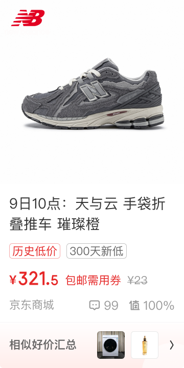

# 20041 · 相似好价卡片新

## 一句话用途
原始名称提供相似好价的用途线索；正式定义仍待好价设计与产品确认。

## 适用与不适用
目标页面已明确使用该编号时，可作为方案引用。不能仅凭历史实验备注推定今天仍在运行，也不能迁移另一端的实验策略。

## 内容结构
以原始档案的低价标签、常规标签与热评配置为线索，具体优先级和组合约束未知。

## 状态与变体
多个视觉示例及版本备注说明存在变化，不证明所有示例同时生效。无标签示例不能直接解释为接口缺字段时的兜底规则。

## 相似组件与差异
与 20040 同时保留。Q03 统一维护差异与分流问题，本档案不另写第二套结论。

## 研发与测试
需研发提供目标版本的 double_cell_type 条件和样例，才能核验映射。试用演示可对比来源，不能演示为自动确定选型。

## 标准预览与来源

[原始编号档案](../../../source/card-finder/knowledge/cards/20041.md)保留完整备注、标准节点及版本。本篇为 AI 整理的评审档案；查询页面同时展示实时构建自快照的原始证据。

## 页面关系
使用 `node packages/zdm-card-knowledge/scripts/query-card.mjs usages 20041` 查询，按证据等级和人工确认状态判断，不能从旁注直接建立已确认页面关系。

## 确认记录
暂无人工确认。知识证据版本：2026.09.01-r2；本篇整理版本：2026.09.11-r1。业务建议与测试建议尚待评审。

