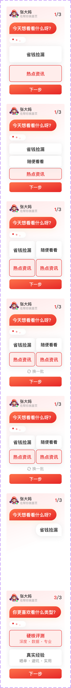

# 20048 · 【调研问卷】多级问卷卡片

## 一句话用途
依据原始名称识别为多级问卷卡片候选，详细业务流程待确认。

## 适用与不适用
可用于定位问卷设计资产，不能将 Default、Variant2、Variant3、Variant4 直接映射为第一到第四题。

## 内容结构
备注出现问题选项与推荐兴趣气泡线索。“问题3固定2个选项”仅归档为具体备注，不外推为所有问卷的规则。

## 状态与变体
保留四个原始变体名。业务中文名、顺序、触发条件与可逆性均在 Q04 中确认。

## 相似组件与差异
与其他调研组件只建立候选比较，不根据外观推定继承或替代关系。

## 研发与测试
建议检查回退后答案保留、分支题跳转及中途退出；这些是评审问题，尚不是该组件已确认能力。

## 标准预览与来源

[原始编号档案](../../../source/card-finder/knowledge/cards/20048.md)保留完整备注、标准节点及版本。本篇为 AI 整理的评审档案；查询页面同时展示实时构建自快照的原始证据。

## 页面关系
使用 `node packages/zdm-card-knowledge/scripts/query-card.mjs usages 20048` 查询，按证据等级和人工确认状态判断，不能从旁注直接建立已确认页面关系。

## 确认记录
暂无人工确认。知识证据版本：2026.09.01-r2；本篇整理版本：2026.09.11-r1。业务建议与测试建议尚待评审。

