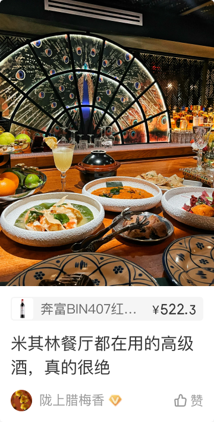

# 22001 · 原创卡片（笔记文章）

## 一句话用途
原始标题为原创卡片（笔记文章），另有个人主页相关标题说明，名称统一待确认。

## 适用与不适用
可用于定位原创内容卡片的现有证据。不能将首页、个人主页主态/客态和 AIGC 各版本的描述直接合并成唯一默认样式。

## 内容结构
来源中能找到商品标签、价格字体、头像、推荐理由、浏览数等说明；这些内容按场景出现，不应全视为必填槽位。字体备注也不是全局排版规范。

## 状态与变体
推荐按“使用场景 × 内容类型 × 版本”整理评审矩阵，区分无商品、已读等状态线索与历史变更。本版不补猜各状态触发条件。

## 相似组件与差异
先确认同编号的不同标题是否需要正式名称归一；不因场景变化新增编号。

## 研发与测试
建议分别测试首页、个人主页主态与客态，并使用目标版本的 AIGC 样例。重点检查头像组合、角标与长标题是否按各自来源处理。

## 标准预览与来源

[原始编号档案](../../../source/card-finder/knowledge/cards/22001.md)保留完整备注、标准节点及版本。本篇为 AI 整理的评审档案；查询页面同时展示实时构建自快照的原始证据。

## 页面关系
使用 `node packages/zdm-card-knowledge/scripts/query-card.mjs usages 22001` 查询，按证据等级和人工确认状态判断，不能从旁注直接建立已确认页面关系。

## 确认记录
暂无人工确认。知识证据版本：2026.09.01-r2；本篇整理版本：2026.09.11-r1。业务建议与测试建议尚待评审。

