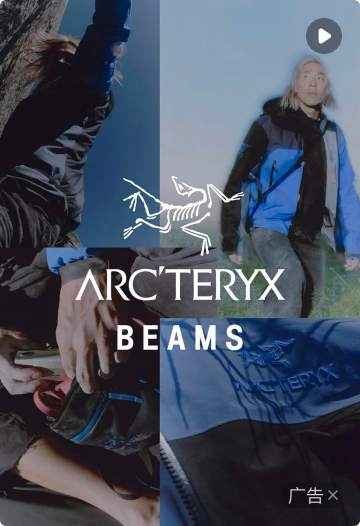

# 23028 · 双列 FEED 流 · 视频大卡

## 一句话用途
来源标题指向双列 FEED 视频大卡，备注含页面位置、暂停与播放中线索。

## 适用与不适用
可用于追溯商业化视频方案。不能将卡片备注的高斯模糊策略推广到全站图片或所有视频。

## 内容结构
素材、封面、背景填充与卡片高度应分别定义。早期上传尺寸和后续比例备注可能属于不同版本，当前不能合并为一份无条件素材规格。

## 状态与变体
暂停、播放中来自备注，自动播放、静音、离屏暂停等行为未核验。不得宣称此组件已经实现这些行为。

## 相似组件与差异
同组说明出现 3:4、9:16 与 16:9，Q07 记录原文冲突。未确认前不认定 16:9 是笔误，也不认定它受支持。

## 研发与测试
按确认后的版本检查比例、无封面、首帧失败与高度变化。生产素材校验器应等待比例集合确认后再编写。

## 标准预览与来源

[原始编号档案](../../../source/card-finder/knowledge/cards/23028.md)保留完整备注、标准节点及版本。本篇为 AI 整理的评审档案；查询页面同时展示实时构建自快照的原始证据。

## 页面关系
使用 `node packages/zdm-card-knowledge/scripts/query-card.mjs usages 23028` 查询，按证据等级和人工确认状态判断，不能从旁注直接建立已确认页面关系。

## 确认记录
暂无人工确认。知识证据版本：2026.09.01-r2；本篇整理版本：2026.09.11-r1。业务建议与测试建议尚待评审。

