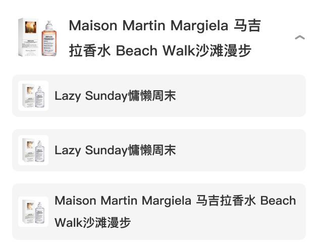

# 33017 · 编辑器链接浮层 · 商品卡片

## 一句话用途
来源标题描述长文编辑器添加链接浮层中的商品卡片。

## 适用与不适用
用于编辑器链接选择场景的候选定位，不能直接用于前台商品信息流。已有预览文件不代表扫描提出的独立本体问题已经解决。

## 内容结构
商品识别信息与 SKU 是评审重点，具体必填项、无 SKU 的业务意义及选择结果尚待接口样例。

## 状态与变体
展开、未展开与无 SKU 来自备注，而非本轮核验过的交互流程。点击何处展开、关闭后是否保留选择需补充。

## 相似组件与差异
与 33018、33019 的来源标题分别指向好价和内容；按链接解析结果区分是待评审建议，不能仅凭 URL 外观硬编码。

## 研发与测试
先关闭 Q06 的本体定位问题，再检查链接解析失败、商品无 SKU、重复添加与返回修改。

## 标准预览与来源

[原始编号档案](../../../source/card-finder/knowledge/cards/33017.md)保留完整备注、标准节点及版本。本篇为 AI 整理的评审档案；查询页面同时展示实时构建自快照的原始证据。

## 页面关系
使用 `node packages/zdm-card-knowledge/scripts/query-card.mjs usages 33017` 查询，按证据等级和人工确认状态判断，不能从旁注直接建立已确认页面关系。

## 确认记录
暂无人工确认。知识证据版本：2026.09.01-r2；本篇整理版本：2026.09.11-r1。业务建议与测试建议尚待评审。

