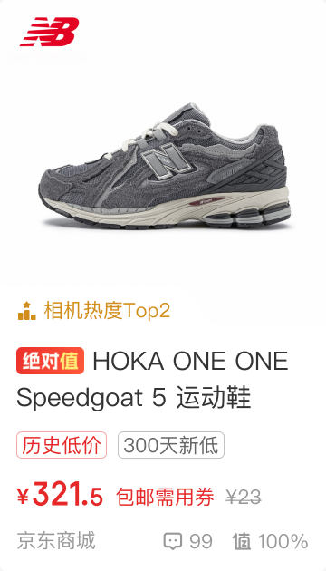

# 20040 · 好价卡片新

## 基本信息

| 项目 | 内容 |
| --- | --- |
| 卡片编号 | 20040 |
| 设计编号 | 20040 |
| 研发编号 | 20040 |
| 正式名称 | 好价卡片新 |
| 基于卡片 | 无明确继承关系 |
| 分类 | 首页双列 |
| 平台规则 | 默认跨端共用，例外待确认 |
| 生命周期 | 使用中（默认假设） |
| 档案状态 | 未人工确认 |
| Figma 来源 | [打开卡片节点](https://www.figma.com/design/bAgan5FT4BJsOkwGpIeGVM/?node-id=16-5568) |
| 最后修改版本 | 2026.09.01-r2 |

## Figma 备注（不属于卡片画面）

以下内容来自卡片旁的设计说明，只用于理解用途、状态和变更；不会合入卡片预览。

| 备注类型 | 原始备注 |
| --- | --- |
| unclassified | 卖点信息 |
| relationship-or-mapping | 多个同款好价 |
| state-or-condition | 无标签 |
| unclassified | 价格部分为活动、字体仍为默认字体 |
| state-or-condition | 过期活动 |
| state-or-condition | 好价售罄&过期&历史发布 |
| state-or-condition | 已读 |
| unclassified | 值友专享限量抢标签样式 |
| unclassified | 值友专享待开抢标签样式 |
| unclassified | 值友专享新品标签样式 |
| change-detail | v11.1.40新增推荐理由 位置-首页新用户、关注新用户 |
| unclassified | 达人 |
| unclassified | 探索类型 |
| change-detail | 11.1.75调整 原20040状态都保留，增热评样式，标签内容分流调整  基础形式改动点：价格和副文案的间距由3改为6，副文案和划线价的间距由3改6 |
| unclassified | ¥ |
| unclassified | 321. |
| unclassified | 5 |
| unclassified | 60天新低 |
| unclassified | ¥23 |
| unclassified | 包邮 |
| unclassified | ¥350 |
| unclassified | 无热评 |
| change-detail | V11.1.90 增加低价标签分流 |
| unclassified | 低于常卖价 |
| unclassified | 标题间距 |

## 卡片本体与示例

预览源节点：16:5568。卡片本体只取 Frame、Component、Component Set 或 Instance；外部编号标题与备注不进入预览。

| 示例 | 节点名称 | 节点类型 | 尺寸 | Node ID |
| --- | --- | --- | --- | --- |
| 1 | card/20040 | COMPONENT | 180 × 315 | 16:5568 |
| 2 | card/20040 | INSTANCE | 180 × 315 | 16:5569 |
| 3 | card/20040 | INSTANCE | 180 × 291 | 16:5836 |
| 4 | card/20040 | INSTANCE | 180 × 315 | 16:5980 |
| 5 | card/20040 | INSTANCE | 180 × 315 | 2387:11947 |
| 6 | card/20040 | INSTANCE | 180 × 315 | 16:6242 |
| 7 | card/20040 | INSTANCE | 180 × 315 | 114:8143 |
| 8 | card/20040 | INSTANCE | 180 × 315 | 3870:14361 |
| 9 | card/20040 | INSTANCE | 180 × 315 | 5273:20691 |
| 10 | card/20040 | INSTANCE | 180 × 315 | 5273:20785 |
| 11 | card/20040 | INSTANCE | 180 × 337 | 5273:22696 |
| 12 | card/20040 | INSTANCE | 180 × 337 | 5274:22862 |
| 13 | card/20040 | INSTANCE | 180 × 337 | 5274:22949 |
| 14 | card/20040 | INSTANCE | 180 × 335 | 9095:25471 |
| 15 | card/20040 | INSTANCE | 180 × 313 | 9095:25678 |
| 16 | card/20040 | INSTANCE | 180 × 313 | 9095:25822 |
| 17 | card/20040 | INSTANCE | 180 × 315 | 10203:22811 |

## 权威编号来源

| Figma 页面 | 区域 | 平台 | 来源 |
| --- | --- | --- | --- |
| 首页 | 首页双列-01 | shared-or-unspecified | [编号标题](https://www.figma.com/design/bAgan5FT4BJsOkwGpIeGVM/?node-id=16-3376) |

## 使用说明

- 使用目的：待补充
- 适用场景：待补充
- 不适用场景：待补充
- 负责人：待补充

## 状态与变体

当前提取状态：partial

| 状态名称 | Figma 原始名称 | 节点 | 尺寸 |
| --- | --- | --- | --- |
| 暂未完成状态提取 | — | — | — |

## 页面使用关系

| 页面 | 证据等级 | 证据节点 | 来源 |
| --- | --- | --- | --- |
| 兴趣聚合2 | 推测匹配 | img_product_recommend_arrow_32x24_card20040 | [打开 Figma](https://www.figma.com/design/lrTnmEfWndqzFHY2kAqgHN/v11.1.95-%E6%96%B0%E7%89%88%E6%9C%AC%E6%B1%87%E6%80%BB?node-id=22023-25473) |
| 兴趣聚合1 | 推测匹配 | img_product_recommend_arrow_32x24_card20040 | [打开 Figma](https://www.figma.com/design/lrTnmEfWndqzFHY2kAqgHN/v11.1.95-%E6%96%B0%E7%89%88%E6%9C%AC%E6%B1%87%E6%80%BB?node-id=22023-25733) |
| 1.3-兴趣聚合-上滑态 | 推测匹配 | img_product_recommend_arrow_32x24_card20040 | [打开 Figma](https://www.figma.com/design/lrTnmEfWndqzFHY2kAqgHN/v11.1.95-%E6%96%B0%E7%89%88%E6%9C%AC%E6%B1%87%E6%80%BB?node-id=22045-30323) |
| 1.1-首页-首页-默认态 | Figma 可追溯 | card/20040 | [打开 Figma](https://www.figma.com/design/lrTnmEfWndqzFHY2kAqgHN/v11.1.95-%E6%96%B0%E7%89%88%E6%9C%AC%E6%B1%87%E6%80%BB?node-id=22135-2297) |
| 5.3-首页-换肤-常规 | Figma 可追溯 | card/20040 | [打开 Figma](https://www.figma.com/design/lrTnmEfWndqzFHY2kAqgHN/v11.1.95-%E6%96%B0%E7%89%88%E6%9C%AC%E6%B1%87%E6%80%BB?node-id=22135-2454) |
| 1.6-首页-吸顶态 | Figma 可追溯 | card/20040 | [打开 Figma](https://www.figma.com/design/lrTnmEfWndqzFHY2kAqgHN/v11.1.95-%E6%96%B0%E7%89%88%E6%9C%AC%E6%B1%87%E6%80%BB?node-id=22135-2548) |
| 1.1-签到-消费挑战赛 | Figma 可追溯 | card/20040 | [打开 Figma](https://www.figma.com/design/lrTnmEfWndqzFHY2kAqgHN/v11.1.95-%E6%96%B0%E7%89%88%E6%9C%AC%E6%B1%87%E6%80%BB?node-id=22172-50953) |
| 1.2-首页-深色 | Figma 可追溯 | card/20040 | [打开 Figma](https://www.figma.com/design/lrTnmEfWndqzFHY2kAqgHN/v11.1.95-%E6%96%B0%E7%89%88%E6%9C%AC%E6%B1%87%E6%80%BB?node-id=22193-10518) |
| 1.3-首页-养宠 | Figma 可追溯 | card/20040 | [打开 Figma](https://www.figma.com/design/lrTnmEfWndqzFHY2kAqgHN/v11.1.95-%E6%96%B0%E7%89%88%E6%9C%AC%E6%B1%87%E6%80%BB?node-id=22193-11112) |
| 1.5-首页-全部兴趣 | Figma 可追溯 | card/20040 | [打开 Figma](https://www.figma.com/design/lrTnmEfWndqzFHY2kAqgHN/v11.1.95-%E6%96%B0%E7%89%88%E6%9C%AC%E6%B1%87%E6%80%BB?node-id=22193-13624) |
| 1.7-首页-品牌Logo支持 | Figma 可追溯 | card/20040 | [打开 Figma](https://www.figma.com/design/lrTnmEfWndqzFHY2kAqgHN/v11.1.95-%E6%96%B0%E7%89%88%E6%9C%AC%E6%B1%87%E6%80%BB?node-id=22193-14662) |
| 2.1-首页-关注-默认态 | Figma 可追溯 | card/20040 | [打开 Figma](https://www.figma.com/design/lrTnmEfWndqzFHY2kAqgHN/v11.1.95-%E6%96%B0%E7%89%88%E6%9C%AC%E6%B1%87%E6%80%BB?node-id=22193-15254) |
| 背景 | Figma 可追溯 | card/20040 | [打开 Figma](https://www.figma.com/design/lrTnmEfWndqzFHY2kAqgHN/v11.1.95-%E6%96%B0%E7%89%88%E6%9C%AC%E6%B1%87%E6%80%BB?node-id=22204-52717) |
| 4.1-首页-下拉刷新-默认态 | Figma 可追溯 | card/20040 | [打开 Figma](https://www.figma.com/design/lrTnmEfWndqzFHY2kAqgHN/v11.1.95-%E6%96%B0%E7%89%88%E6%9C%AC%E6%B1%87%E6%80%BB?node-id=22205-14132) |
| 4.2-首页-下拉刷新-数据展示 | Figma 可追溯 | card/20040 | [打开 Figma](https://www.figma.com/design/lrTnmEfWndqzFHY2kAqgHN/v11.1.95-%E6%96%B0%E7%89%88%E6%9C%AC%E6%B1%87%E6%80%BB?node-id=22205-14722) |
| 4.3-首页-下拉刷新-每日首次刷新 | Figma 可追溯 | card/20040 | [打开 Figma](https://www.figma.com/design/lrTnmEfWndqzFHY2kAqgHN/v11.1.95-%E6%96%B0%E7%89%88%E6%9C%AC%E6%B1%87%E6%80%BB?node-id=22205-15334) |
| 4.4-首页-下拉刷新-每日首次刷新-无占比 | Figma 可追溯 | card/20040 | [打开 Figma](https://www.figma.com/design/lrTnmEfWndqzFHY2kAqgHN/v11.1.95-%E6%96%B0%E7%89%88%E6%9C%AC%E6%B1%87%E6%80%BB?node-id=22205-16034) |
| 5.2-首页-商业化-换肤浅色 | Figma 可追溯 | card/20040 | [打开 Figma](https://www.figma.com/design/lrTnmEfWndqzFHY2kAqgHN/v11.1.95-%E6%96%B0%E7%89%88%E6%9C%AC%E6%B1%87%E6%80%BB?node-id=22205-17388) |
| 5.1-首页-商业化-大Banner深色 | Figma 可追溯 | card/20040 | [打开 Figma](https://www.figma.com/design/lrTnmEfWndqzFHY2kAqgHN/v11.1.95-%E6%96%B0%E7%89%88%E6%9C%AC%E6%B1%87%E6%80%BB?node-id=22205-18086) |
| 5.5-首页-商业化-巨幕广告TopSearch | Figma 可追溯 | card/20040 | [打开 Figma](https://www.figma.com/design/lrTnmEfWndqzFHY2kAqgHN/v11.1.95-%E6%96%B0%E7%89%88%E6%9C%AC%E6%B1%87%E6%80%BB?node-id=22205-18977) |
| 5.4-首页-商业化-换肤状态下巨幕广告 | Figma 可追溯 | card/20040 | [打开 Figma](https://www.figma.com/design/lrTnmEfWndqzFHY2kAqgHN/v11.1.95-%E6%96%B0%E7%89%88%E6%9C%AC%E6%B1%87%E6%80%BB?node-id=22205-19594) |
| 3.1-首页-引导 | Figma 可追溯 | card/20040 | [打开 Figma](https://www.figma.com/design/lrTnmEfWndqzFHY2kAqgHN/v11.1.95-%E6%96%B0%E7%89%88%E6%9C%AC%E6%B1%87%E6%80%BB?node-id=22205-31330) |
| 6.1-首页-底部Tab说明-首页-默认态 | Figma 可追溯 | card/20040 | [打开 Figma](https://www.figma.com/design/lrTnmEfWndqzFHY2kAqgHN/v11.1.95-%E6%96%B0%E7%89%88%E6%9C%AC%E6%B1%87%E6%80%BB?node-id=22230-64261) |
| 6.2-首页-底部Tab说明-深色 | Figma 可追溯 | card/20040 | [打开 Figma](https://www.figma.com/design/lrTnmEfWndqzFHY2kAqgHN/v11.1.95-%E6%96%B0%E7%89%88%E6%9C%AC%E6%B1%87%E6%80%BB?node-id=22230-64291) |
| 底部tab-常规 | Figma 可追溯 | card/20040 | [打开 Figma](https://www.figma.com/design/lrTnmEfWndqzFHY2kAqgHN/v11.1.95-%E6%96%B0%E7%89%88%E6%9C%AC%E6%B1%87%E6%80%BB?node-id=22230-69163) |
| 底部tab深色 | Figma 可追溯 | card/20040 | [打开 Figma](https://www.figma.com/design/lrTnmEfWndqzFHY2kAqgHN/v11.1.95-%E6%96%B0%E7%89%88%E6%9C%AC%E6%B1%87%E6%80%BB?node-id=22230-69193) |
| 1.2-个人主页-主态-爆料 | Figma 可追溯 | card/20040 | [打开 Figma](https://www.figma.com/design/lrTnmEfWndqzFHY2kAqgHN/v11.1.95-%E6%96%B0%E7%89%88%E6%9C%AC%E6%B1%87%E6%80%BB?node-id=22329-9778) |
| 1.1-签到-消费挑战赛 | Figma 可追溯 | card/20040 | [打开 Figma](https://www.figma.com/design/lrTnmEfWndqzFHY2kAqgHN/v11.1.95-%E6%96%B0%E7%89%88%E6%9C%AC%E6%B1%87%E6%80%BB?node-id=22359-46115) |
| 深色背景换肤-吸顶态 | Figma 可追溯 | card/20040 | [打开 Figma](https://www.figma.com/design/lrTnmEfWndqzFHY2kAqgHN/v11.1.95-%E6%96%B0%E7%89%88%E6%9C%AC%E6%B1%87%E6%80%BB?node-id=22363-70258) |
| 浅色背景换肤-吸顶态 | Figma 可追溯 | card/20040 | [打开 Figma](https://www.figma.com/design/lrTnmEfWndqzFHY2kAqgHN/v11.1.95-%E6%96%B0%E7%89%88%E6%9C%AC%E6%B1%87%E6%80%BB?node-id=22363-70778) |
| 安卓端带虚拟按键 | Figma 可追溯 | card/20040 | [打开 Figma](https://www.figma.com/design/lrTnmEfWndqzFHY2kAqgHN/v11.1.95-%E6%96%B0%E7%89%88%E6%9C%AC%E6%B1%87%E6%80%BB?node-id=22407-85257) |
| 安卓端带桌面显示器 | Figma 可追溯 | card/20040 | [打开 Figma](https://www.figma.com/design/lrTnmEfWndqzFHY2kAqgHN/v11.1.95-%E6%96%B0%E7%89%88%E6%9C%AC%E6%B1%87%E6%80%BB?node-id=22407-93087) |
| 1.1-签到-消费挑战赛 | Figma 可追溯 | card/20040 | [打开 Figma](https://www.figma.com/design/lrTnmEfWndqzFHY2kAqgHN/v11.1.95-%E6%96%B0%E7%89%88%E6%9C%AC%E6%B1%87%E6%80%BB?node-id=22414-19286) |
| 1.1-签到-消费挑战赛 | Figma 可追溯 | card/20040 | [打开 Figma](https://www.figma.com/design/lrTnmEfWndqzFHY2kAqgHN/v11.1.95-%E6%96%B0%E7%89%88%E6%9C%AC%E6%B1%87%E6%80%BB?node-id=22414-25503) |
| 1.1-签到-消费挑战赛 | Figma 可追溯 | card/20040 | [打开 Figma](https://www.figma.com/design/lrTnmEfWndqzFHY2kAqgHN/v11.1.95-%E6%96%B0%E7%89%88%E6%9C%AC%E6%B1%87%E6%80%BB?node-id=22414-26718) |
| 1.1-签到-消费挑战赛 | Figma 可追溯 | card/20040 | [打开 Figma](https://www.figma.com/design/lrTnmEfWndqzFHY2kAqgHN/v11.1.95-%E6%96%B0%E7%89%88%E6%9C%AC%E6%B1%87%E6%80%BB?node-id=22414-27497) |
| 1.1-签到-消费挑战赛 | Figma 可追溯 | card/20040 | [打开 Figma](https://www.figma.com/design/lrTnmEfWndqzFHY2kAqgHN/v11.1.95-%E6%96%B0%E7%89%88%E6%9C%AC%E6%B1%87%E6%80%BB?node-id=22414-28271) |
| 1.1-签到-消费挑战赛 | Figma 可追溯 | card/20040 | [打开 Figma](https://www.figma.com/design/lrTnmEfWndqzFHY2kAqgHN/v11.1.95-%E6%96%B0%E7%89%88%E6%9C%AC%E6%B1%87%E6%80%BB?node-id=22414-30334) |
| 1.1-签到-消费挑战赛 | Figma 可追溯 | card/20040 | [打开 Figma](https://www.figma.com/design/lrTnmEfWndqzFHY2kAqgHN/v11.1.95-%E6%96%B0%E7%89%88%E6%9C%AC%E6%B1%87%E6%80%BB?node-id=22414-31168) |
| 1.1-签到-消费挑战赛 | Figma 可追溯 | card/20040 | [打开 Figma](https://www.figma.com/design/lrTnmEfWndqzFHY2kAqgHN/v11.1.95-%E6%96%B0%E7%89%88%E6%9C%AC%E6%B1%87%E6%80%BB?node-id=22414-31963) |
| 1.1-签到-消费挑战赛 | Figma 可追溯 | card/20040 | [打开 Figma](https://www.figma.com/design/lrTnmEfWndqzFHY2kAqgHN/v11.1.95-%E6%96%B0%E7%89%88%E6%9C%AC%E6%B1%87%E6%80%BB?node-id=22414-32919) |
| 订阅浮层 | 推测匹配 | img_product_recommend_arrow_32x24_card20040 | [打开 Figma](https://www.figma.com/design/lrTnmEfWndqzFHY2kAqgHN/v11.1.95-%E6%96%B0%E7%89%88%E6%9C%AC%E6%B1%87%E6%80%BB?node-id=22459-5298) |
| 订阅浮层暗色 | 推测匹配 | img_product_recommend_arrow_32x24_card20040 | [打开 Figma](https://www.figma.com/design/lrTnmEfWndqzFHY2kAqgHN/v11.1.95-%E6%96%B0%E7%89%88%E6%9C%AC%E6%B1%87%E6%80%BB?node-id=22470-6944) |
| 1.2-个人主页-客态-爆料 | Figma 可追溯 | card/20040 | [打开 Figma](https://www.figma.com/design/lrTnmEfWndqzFHY2kAqgHN/v11.1.95-%E6%96%B0%E7%89%88%E6%9C%AC%E6%B1%87%E6%80%BB?node-id=22478-124110) |
| 1.1-签到-消费挑战赛 | Figma 可追溯 | card/20040 | [打开 Figma](https://www.figma.com/design/lrTnmEfWndqzFHY2kAqgHN/v11.1.95-%E6%96%B0%E7%89%88%E6%9C%AC%E6%B1%87%E6%80%BB?node-id=22498-37392) |
| 1.1-签到-消费挑战赛 | Figma 可追溯 | card/20040 | [打开 Figma](https://www.figma.com/design/lrTnmEfWndqzFHY2kAqgHN/v11.1.95-%E6%96%B0%E7%89%88%E6%9C%AC%E6%B1%87%E6%80%BB?node-id=22498-39162) |
| 1.1-签到-消费挑战赛 | Figma 可追溯 | card/20040 | [打开 Figma](https://www.figma.com/design/lrTnmEfWndqzFHY2kAqgHN/v11.1.95-%E6%96%B0%E7%89%88%E6%9C%AC%E6%B1%87%E6%80%BB?node-id=22521-40805) |
| 1.1-签到-消费挑战赛 | Figma 可追溯 | card/20040 | [打开 Figma](https://www.figma.com/design/lrTnmEfWndqzFHY2kAqgHN/v11.1.95-%E6%96%B0%E7%89%88%E6%9C%AC%E6%B1%87%E6%80%BB?node-id=22524-45093) |
| 1.1-签到-消费挑战赛 | Figma 可追溯 | card/20040 | [打开 Figma](https://www.figma.com/design/lrTnmEfWndqzFHY2kAqgHN/v11.1.95-%E6%96%B0%E7%89%88%E6%9C%AC%E6%B1%87%E6%80%BB?node-id=22526-45951) |
| 1.1-签到-消费挑战赛 | Figma 可追溯 | card/20040 | [打开 Figma](https://www.figma.com/design/lrTnmEfWndqzFHY2kAqgHN/v11.1.95-%E6%96%B0%E7%89%88%E6%9C%AC%E6%B1%87%E6%80%BB?node-id=22528-47070) |
| 1.1-签到-消费挑战赛 | Figma 可追溯 | card/20040 | [打开 Figma](https://www.figma.com/design/lrTnmEfWndqzFHY2kAqgHN/v11.1.95-%E6%96%B0%E7%89%88%E6%9C%AC%E6%B1%87%E6%80%BB?node-id=22533-48581) |
| 1.1-签到-消费挑战赛 | Figma 可追溯 | card/20040 | [打开 Figma](https://www.figma.com/design/lrTnmEfWndqzFHY2kAqgHN/v11.1.95-%E6%96%B0%E7%89%88%E6%9C%AC%E6%B1%87%E6%80%BB?node-id=22536-49561) |
| 2.1-首页-关注-默认态 | Figma 可追溯 | card/20040 | [打开 Figma](https://www.figma.com/design/lrTnmEfWndqzFHY2kAqgHN/v11.1.95-%E6%96%B0%E7%89%88%E6%9C%AC%E6%B1%87%E6%80%BB?node-id=22552-112410) |
| 1.1-首页-首页-默认态 | Figma 可追溯 | card/20040 | [打开 Figma](https://www.figma.com/design/lrTnmEfWndqzFHY2kAqgHN/v11.1.95-%E6%96%B0%E7%89%88%E6%9C%AC%E6%B1%87%E6%80%BB?node-id=22552-19089) |
| 1.3-首页-养宠 | Figma 可追溯 | card/20040 | [打开 Figma](https://www.figma.com/design/lrTnmEfWndqzFHY2kAqgHN/v11.1.95-%E6%96%B0%E7%89%88%E6%9C%AC%E6%B1%87%E6%80%BB?node-id=22552-19160) |
| 1.6-首页-吸顶态 | Figma 可追溯 | card/20040 | [打开 Figma](https://www.figma.com/design/lrTnmEfWndqzFHY2kAqgHN/v11.1.95-%E6%96%B0%E7%89%88%E6%9C%AC%E6%B1%87%E6%80%BB?node-id=22552-19287) |
| 1.1-兴趣聚合-示例1 | 推测匹配 | img_product_recommend_arrow_32x24_card20040 | [打开 Figma](https://www.figma.com/design/lrTnmEfWndqzFHY2kAqgHN/v11.1.95-%E6%96%B0%E7%89%88%E6%9C%AC%E6%B1%87%E6%80%BB?node-id=22552-67754) |
| 1.1-签到-消费挑战赛 | Figma 可追溯 | card/20040 | [打开 Figma](https://www.figma.com/design/lrTnmEfWndqzFHY2kAqgHN/v11.1.95-%E6%96%B0%E7%89%88%E6%9C%AC%E6%B1%87%E6%80%BB?node-id=22553-50329) |
| 1.1-签到-消费挑战赛 | Figma 可追溯 | card/20040 | [打开 Figma](https://www.figma.com/design/lrTnmEfWndqzFHY2kAqgHN/v11.1.95-%E6%96%B0%E7%89%88%E6%9C%AC%E6%B1%87%E6%80%BB?node-id=22553-51202) |
| 1.1-签到-消费挑战赛 | Figma 可追溯 | card/20040 | [打开 Figma](https://www.figma.com/design/lrTnmEfWndqzFHY2kAqgHN/v11.1.95-%E6%96%B0%E7%89%88%E6%9C%AC%E6%B1%87%E6%80%BB?node-id=22553-54023) |
| 1.1-签到-消费挑战赛 | Figma 可追溯 | card/20040 | [打开 Figma](https://www.figma.com/design/lrTnmEfWndqzFHY2kAqgHN/v11.1.95-%E6%96%B0%E7%89%88%E6%9C%AC%E6%B1%87%E6%80%BB?node-id=22580-62980) |
| 01-签到-消费挑战赛-新人 | Figma 可追溯 | card/20040 | [打开 Figma](https://www.figma.com/design/lrTnmEfWndqzFHY2kAqgHN/v11.1.95-%E6%96%B0%E7%89%88%E6%9C%AC%E6%B1%87%E6%80%BB?node-id=22639-168562) |
| 01-签到-消费挑战赛-新人 | Figma 可追溯 | card/20040 | [打开 Figma](https://www.figma.com/design/lrTnmEfWndqzFHY2kAqgHN/v11.1.95-%E6%96%B0%E7%89%88%E6%9C%AC%E6%B1%87%E6%80%BB?node-id=22639-175943) |
| 01-签到-消费挑战赛-到账10元浮层 | Figma 可追溯 | card/20040 | [打开 Figma](https://www.figma.com/design/lrTnmEfWndqzFHY2kAqgHN/v11.1.95-%E6%96%B0%E7%89%88%E6%9C%AC%E6%B1%87%E6%80%BB?node-id=22650-150410) |
| 01-签到-消费挑战赛-到账20元浮层 | Figma 可追溯 | card/20040 | [打开 Figma](https://www.figma.com/design/lrTnmEfWndqzFHY2kAqgHN/v11.1.95-%E6%96%B0%E7%89%88%E6%9C%AC%E6%B1%87%E6%80%BB?node-id=22650-151693) |
| 01-签到-消费挑战赛-新人 | Figma 可追溯 | card/20040 | [打开 Figma](https://www.figma.com/design/lrTnmEfWndqzFHY2kAqgHN/v11.1.95-%E6%96%B0%E7%89%88%E6%9C%AC%E6%B1%87%E6%80%BB?node-id=22650-92366) |
| 01-签到-消费挑战赛-新人 | Figma 可追溯 | card/20040 | [打开 Figma](https://www.figma.com/design/lrTnmEfWndqzFHY2kAqgHN/v11.1.95-%E6%96%B0%E7%89%88%E6%9C%AC%E6%B1%87%E6%80%BB?node-id=22650-93164) |
| 01-签到-消费挑战赛-新人 | Figma 可追溯 | card/20040 | [打开 Figma](https://www.figma.com/design/lrTnmEfWndqzFHY2kAqgHN/v11.1.95-%E6%96%B0%E7%89%88%E6%9C%AC%E6%B1%87%E6%80%BB?node-id=22650-94292) |
| 01-签到-消费挑战赛-新人 | Figma 可追溯 | card/20040 | [打开 Figma](https://www.figma.com/design/lrTnmEfWndqzFHY2kAqgHN/v11.1.95-%E6%96%B0%E7%89%88%E6%9C%AC%E6%B1%87%E6%80%BB?node-id=22650-95082) |
| 01-签到-消费挑战赛-新人 | Figma 可追溯 | card/20040 | [打开 Figma](https://www.figma.com/design/lrTnmEfWndqzFHY2kAqgHN/v11.1.95-%E6%96%B0%E7%89%88%E6%9C%AC%E6%B1%87%E6%80%BB?node-id=22650-96645) |
| 01-签到-消费挑战赛-快速填订单浮层 | Figma 可追溯 | card/20040 | [打开 Figma](https://www.figma.com/design/lrTnmEfWndqzFHY2kAqgHN/v11.1.95-%E6%96%B0%E7%89%88%E6%9C%AC%E6%B1%87%E6%80%BB?node-id=22650-97499) |
| 01-签到-消费挑战赛-新人 | Figma 可追溯 | card/20040 | [打开 Figma](https://www.figma.com/design/lrTnmEfWndqzFHY2kAqgHN/v11.1.95-%E6%96%B0%E7%89%88%E6%9C%AC%E6%B1%87%E6%80%BB?node-id=22712-154993) |
| 01-签到-消费挑战赛-新人 | Figma 可追溯 | card/20040 | [打开 Figma](https://www.figma.com/design/lrTnmEfWndqzFHY2kAqgHN/v11.1.95-%E6%96%B0%E7%89%88%E6%9C%AC%E6%B1%87%E6%80%BB?node-id=22712-156403) |
| 01-签到-消费挑战赛-到账10元浮层 | Figma 可追溯 | card/20040 | [打开 Figma](https://www.figma.com/design/lrTnmEfWndqzFHY2kAqgHN/v11.1.95-%E6%96%B0%E7%89%88%E6%9C%AC%E6%B1%87%E6%80%BB?node-id=22712-157135) |
| 背景 | Figma 可追溯 | card/20040 | [打开 Figma](https://www.figma.com/design/lrTnmEfWndqzFHY2kAqgHN/v11.1.95-%E6%96%B0%E7%89%88%E6%9C%AC%E6%B1%87%E6%80%BB?node-id=22712-158870) |
| 01-签到-消费挑战赛-到账10元浮层 | Figma 可追溯 | card/20040 | [打开 Figma](https://www.figma.com/design/lrTnmEfWndqzFHY2kAqgHN/v11.1.95-%E6%96%B0%E7%89%88%E6%9C%AC%E6%B1%87%E6%80%BB?node-id=22712-160020) |
| 01-签到-消费挑战赛-到账10元浮层 | Figma 可追溯 | card/20040 | [打开 Figma](https://www.figma.com/design/lrTnmEfWndqzFHY2kAqgHN/v11.1.95-%E6%96%B0%E7%89%88%E6%9C%AC%E6%B1%87%E6%80%BB?node-id=22712-160962) |
| 01-签到-消费挑战赛-到账10元浮层 | Figma 可追溯 | card/20040 | [打开 Figma](https://www.figma.com/design/lrTnmEfWndqzFHY2kAqgHN/v11.1.95-%E6%96%B0%E7%89%88%E6%9C%AC%E6%B1%87%E6%80%BB?node-id=22712-161856) |
| 01-签到-消费挑战赛-到账10元浮层 | Figma 可追溯 | card/20040 | [打开 Figma](https://www.figma.com/design/lrTnmEfWndqzFHY2kAqgHN/v11.1.95-%E6%96%B0%E7%89%88%E6%9C%AC%E6%B1%87%E6%80%BB?node-id=22712-162738) |
| 1.1-兴趣聚合-示例1 | 推测匹配 | img_product_recommend_arrow_32x24_card20040 | [打开 Figma](https://www.figma.com/design/lrTnmEfWndqzFHY2kAqgHN/v11.1.95-%E6%96%B0%E7%89%88%E6%9C%AC%E6%B1%87%E6%80%BB?node-id=22729-10579) |
| 1.1-兴趣聚合-示例1 | 推测匹配 | img_product_recommend_arrow_32x24_card20040 | [打开 Figma](https://www.figma.com/design/lrTnmEfWndqzFHY2kAqgHN/v11.1.95-%E6%96%B0%E7%89%88%E6%9C%AC%E6%B1%87%E6%80%BB?node-id=22729-11716) |
| 1.1 通用样式-免费版 | 推测匹配 | img_product_recommend_arrow_32x24_card20040 | [打开 Figma](https://www.figma.com/design/lrTnmEfWndqzFHY2kAqgHN/v11.1.95-%E6%96%B0%E7%89%88%E6%9C%AC%E6%B1%87%E6%80%BB?node-id=22729-13557) |
| 1.1 通用样式-免费版 | 推测匹配 | img_product_recommend_arrow_32x24_card20040 | [打开 Figma](https://www.figma.com/design/lrTnmEfWndqzFHY2kAqgHN/v11.1.95-%E6%96%B0%E7%89%88%E6%9C%AC%E6%B1%87%E6%80%BB?node-id=22729-15264) |
| 1.1-兴趣聚合-示例1 | 推测匹配 | img_product_recommend_arrow_32x24_card20040 | [打开 Figma](https://www.figma.com/design/lrTnmEfWndqzFHY2kAqgHN/v11.1.95-%E6%96%B0%E7%89%88%E6%9C%AC%E6%B1%87%E6%80%BB?node-id=22729-15952) |
| 1.1 通用样式-免费版 | 推测匹配 | img_product_recommend_arrow_32x24_card20040 | [打开 Figma](https://www.figma.com/design/lrTnmEfWndqzFHY2kAqgHN/v11.1.95-%E6%96%B0%E7%89%88%E6%9C%AC%E6%B1%87%E6%80%BB?node-id=22729-19598) |
| 1.1-兴趣聚合-示例1 | 推测匹配 | img_product_recommend_arrow_32x24_card20040 | [打开 Figma](https://www.figma.com/design/lrTnmEfWndqzFHY2kAqgHN/v11.1.95-%E6%96%B0%E7%89%88%E6%9C%AC%E6%B1%87%E6%80%BB?node-id=22729-20286) |
| 1.1-兴趣聚合-示例1 | 推测匹配 | img_product_recommend_arrow_32x24_card20040 | [打开 Figma](https://www.figma.com/design/lrTnmEfWndqzFHY2kAqgHN/v11.1.95-%E6%96%B0%E7%89%88%E6%9C%AC%E6%B1%87%E6%80%BB?node-id=22729-20796) |
| 1.1-兴趣聚合-示例1 | 推测匹配 | img_product_recommend_arrow_32x24_card20040 | [打开 Figma](https://www.figma.com/design/lrTnmEfWndqzFHY2kAqgHN/v11.1.95-%E6%96%B0%E7%89%88%E6%9C%AC%E6%B1%87%E6%80%BB?node-id=22729-22301) |
| 1.1-兴趣聚合-示例1 | 推测匹配 | img_product_recommend_arrow_32x24_card20040 | [打开 Figma](https://www.figma.com/design/lrTnmEfWndqzFHY2kAqgHN/v11.1.95-%E6%96%B0%E7%89%88%E6%9C%AC%E6%B1%87%E6%80%BB?node-id=22729-22873) |
| 品牌-已订阅 | 推测匹配 | img_product_recommend_arrow_32x24_card20040 | [打开 Figma](https://www.figma.com/design/lrTnmEfWndqzFHY2kAqgHN/v11.1.95-%E6%96%B0%E7%89%88%E6%9C%AC%E6%B1%87%E6%80%BB?node-id=22729-23667) |
| 1.1-兴趣聚合-示例1 | 推测匹配 | img_product_recommend_arrow_32x24_card20040 | [打开 Figma](https://www.figma.com/design/lrTnmEfWndqzFHY2kAqgHN/v11.1.95-%E6%96%B0%E7%89%88%E6%9C%AC%E6%B1%87%E6%80%BB?node-id=22729-24704) |
| 1.1-兴趣聚合-示例1 | 推测匹配 | img_product_recommend_arrow_32x24_card20040 | [打开 Figma](https://www.figma.com/design/lrTnmEfWndqzFHY2kAqgHN/v11.1.95-%E6%96%B0%E7%89%88%E6%9C%AC%E6%B1%87%E6%80%BB?node-id=22729-27062) |
| 品牌-未订阅 | 推测匹配 | img_product_recommend_arrow_32x24_card20040 | [打开 Figma](https://www.figma.com/design/lrTnmEfWndqzFHY2kAqgHN/v11.1.95-%E6%96%B0%E7%89%88%E6%9C%AC%E6%B1%87%E6%80%BB?node-id=22729-28059) |
| 1.1-兴趣聚合-示例1 | 推测匹配 | img_product_recommend_arrow_32x24_card20040 | [打开 Figma](https://www.figma.com/design/lrTnmEfWndqzFHY2kAqgHN/v11.1.95-%E6%96%B0%E7%89%88%E6%9C%AC%E6%B1%87%E6%80%BB?node-id=22729-30303) |
| 品牌-已订阅 | 推测匹配 | img_product_recommend_arrow_32x24_card20040 | [打开 Figma](https://www.figma.com/design/lrTnmEfWndqzFHY2kAqgHN/v11.1.95-%E6%96%B0%E7%89%88%E6%9C%AC%E6%B1%87%E6%80%BB?node-id=22729-30888) |
| 订阅成功提示toast-订阅成功 | Figma 可追溯 | card/20040 | [打开 Figma](https://www.figma.com/design/lrTnmEfWndqzFHY2kAqgHN/v11.1.95-%E6%96%B0%E7%89%88%E6%9C%AC%E6%B1%87%E6%80%BB?node-id=22752-186951) |
| feed | Figma 可追溯 | card/20040 | [打开 Figma](https://www.figma.com/design/lrTnmEfWndqzFHY2kAqgHN/v11.1.95-%E6%96%B0%E7%89%88%E6%9C%AC%E6%B1%87%E6%80%BB?node-id=22752-194283) |
| feed | Figma 可追溯 | card/20040 | [打开 Figma](https://www.figma.com/design/lrTnmEfWndqzFHY2kAqgHN/v11.1.95-%E6%96%B0%E7%89%88%E6%9C%AC%E6%B1%87%E6%80%BB?node-id=22752-194932) |
| feed | Figma 可追溯 | card/20040 | [打开 Figma](https://www.figma.com/design/lrTnmEfWndqzFHY2kAqgHN/v11.1.95-%E6%96%B0%E7%89%88%E6%9C%AC%E6%B1%87%E6%80%BB?node-id=22752-195501) |
| feed | Figma 可追溯 | card/20040 | [打开 Figma](https://www.figma.com/design/lrTnmEfWndqzFHY2kAqgHN/v11.1.95-%E6%96%B0%E7%89%88%E6%9C%AC%E6%B1%87%E6%80%BB?node-id=22752-196071) |
| feed | Figma 可追溯 | card/20040 | [打开 Figma](https://www.figma.com/design/lrTnmEfWndqzFHY2kAqgHN/v11.1.95-%E6%96%B0%E7%89%88%E6%9C%AC%E6%B1%87%E6%80%BB?node-id=22752-196640) |
| 1.3-首页-养宠 | Figma 可追溯 | card/20040 | [打开 Figma](https://www.figma.com/design/lrTnmEfWndqzFHY2kAqgHN/v11.1.95-%E6%96%B0%E7%89%88%E6%9C%AC%E6%B1%87%E6%80%BB?node-id=22752-197413) |
| 01-签到-消费挑战赛-新人 | Figma 可追溯 | card/20040 | [打开 Figma](https://www.figma.com/design/lrTnmEfWndqzFHY2kAqgHN/v11.1.95-%E6%96%B0%E7%89%88%E6%9C%AC%E6%B1%87%E6%80%BB?node-id=22754-40177) |
| 01-签到-消费挑战赛-新人 | Figma 可追溯 | card/20040 | [打开 Figma](https://www.figma.com/design/lrTnmEfWndqzFHY2kAqgHN/v11.1.95-%E6%96%B0%E7%89%88%E6%9C%AC%E6%B1%87%E6%80%BB?node-id=22754-40978) |
| 01-签到-消费挑战赛-新人 | Figma 可追溯 | card/20040 | [打开 Figma](https://www.figma.com/design/lrTnmEfWndqzFHY2kAqgHN/v11.1.95-%E6%96%B0%E7%89%88%E6%9C%AC%E6%B1%87%E6%80%BB?node-id=22754-50087) |
| 01-签到-消费挑战赛-上滑吸顶 | Figma 可追溯 | card/20040 | [打开 Figma](https://www.figma.com/design/lrTnmEfWndqzFHY2kAqgHN/v11.1.95-%E6%96%B0%E7%89%88%E6%9C%AC%E6%B1%87%E6%80%BB?node-id=22754-50958) |
| 品牌-未订阅 | 推测匹配 | img_product_recommend_arrow_32x24_card20040 | [打开 Figma](https://www.figma.com/design/lrTnmEfWndqzFHY2kAqgHN/v11.1.95-%E6%96%B0%E7%89%88%E6%9C%AC%E6%B1%87%E6%80%BB?node-id=22805-74477) |
| 01-签到-消费挑战赛-新人 | Figma 可追溯 | card/20040 | [打开 Figma](https://www.figma.com/design/lrTnmEfWndqzFHY2kAqgHN/v11.1.95-%E6%96%B0%E7%89%88%E6%9C%AC%E6%B1%87%E6%80%BB?node-id=22849-96036) |
| 01-签到-消费挑战赛-新人 | Figma 可追溯 | card/20040 | [打开 Figma](https://www.figma.com/design/lrTnmEfWndqzFHY2kAqgHN/v11.1.95-%E6%96%B0%E7%89%88%E6%9C%AC%E6%B1%87%E6%80%BB?node-id=22849-98264) |
| 1.3-首页-无tab情况 | Figma 可追溯 | card/20040 | [打开 Figma](https://www.figma.com/design/lrTnmEfWndqzFHY2kAqgHN/v11.1.95-%E6%96%B0%E7%89%88%E6%9C%AC%E6%B1%87%E6%80%BB?node-id=22851-24964) |
| 兴趣聚合无tab | 推测匹配 | img_product_recommend_arrow_32x24_card20040 | [打开 Figma](https://www.figma.com/design/lrTnmEfWndqzFHY2kAqgHN/v11.1.95-%E6%96%B0%E7%89%88%E6%9C%AC%E6%B1%87%E6%80%BB?node-id=22858-79230) |
| 01-签到-消费挑战赛-新人 | Figma 可追溯 | card/20040 | [打开 Figma](https://www.figma.com/design/lrTnmEfWndqzFHY2kAqgHN/v11.1.95-%E6%96%B0%E7%89%88%E6%9C%AC%E6%B1%87%E6%80%BB?node-id=22869-103219) |
| 01-签到-消费挑战赛-到账10元浮层 | Figma 可追溯 | card/20040 | [打开 Figma](https://www.figma.com/design/lrTnmEfWndqzFHY2kAqgHN/v11.1.95-%E6%96%B0%E7%89%88%E6%9C%AC%E6%B1%87%E6%80%BB?node-id=22872-36711) |
| 03-签到-签到成就-贴纸 | Figma 可追溯 | card/20040 | [打开 Figma](https://www.figma.com/design/lrTnmEfWndqzFHY2kAqgHN/v11.1.95-%E6%96%B0%E7%89%88%E6%9C%AC%E6%B1%87%E6%80%BB?node-id=22872-70512) |
| 下拉刷新 | 推测匹配 | img_product_recommend_arrow_32x24_card20040 | [打开 Figma](https://www.figma.com/design/lrTnmEfWndqzFHY2kAqgHN/v11.1.95-%E6%96%B0%E7%89%88%E6%9C%AC%E6%B1%87%E6%80%BB?node-id=22966-182808) |
| 01-签到-消费挑战赛-新人 | Figma 可追溯 | card/20040 | [打开 Figma](https://www.figma.com/design/lrTnmEfWndqzFHY2kAqgHN/v11.1.95-%E6%96%B0%E7%89%88%E6%9C%AC%E6%B1%87%E6%80%BB?node-id=22974-40809) |
| 01-签到-消费挑战赛-新人 | Figma 可追溯 | card/20040 | [打开 Figma](https://www.figma.com/design/lrTnmEfWndqzFHY2kAqgHN/v11.1.95-%E6%96%B0%E7%89%88%E6%9C%AC%E6%B1%87%E6%80%BB?node-id=22985-46968) |
| 01-签到-消费挑战赛-新人 | Figma 可追溯 | card/20040 | [打开 Figma](https://www.figma.com/design/lrTnmEfWndqzFHY2kAqgHN/v11.1.95-%E6%96%B0%E7%89%88%E6%9C%AC%E6%B1%87%E6%80%BB?node-id=22985-91854) |
| 01-签到-消费挑战赛-老用户 | Figma 可追溯 | card/20040 | [打开 Figma](https://www.figma.com/design/lrTnmEfWndqzFHY2kAqgHN/v11.1.95-%E6%96%B0%E7%89%88%E6%9C%AC%E6%B1%87%E6%80%BB?node-id=23022-42756) |
| 01-签到-消费挑战赛-新人-2阶段 | Figma 可追溯 | card/20040 | [打开 Figma](https://www.figma.com/design/lrTnmEfWndqzFHY2kAqgHN/v11.1.95-%E6%96%B0%E7%89%88%E6%9C%AC%E6%B1%87%E6%80%BB?node-id=23022-44216) |
| 02-签到-签到日历 | Figma 可追溯 | card/20040 | [打开 Figma](https://www.figma.com/design/lrTnmEfWndqzFHY2kAqgHN/v11.1.95-%E6%96%B0%E7%89%88%E6%9C%AC%E6%B1%87%E6%80%BB?node-id=23022-45738) |
| 02-签到-签到日历-21天活动 | Figma 可追溯 | card/20040 | [打开 Figma](https://www.figma.com/design/lrTnmEfWndqzFHY2kAqgHN/v11.1.95-%E6%96%B0%E7%89%88%E6%9C%AC%E6%B1%87%E6%80%BB?node-id=23022-48204) |
| 02-签到-签到日历-签到提醒气泡 | Figma 可追溯 | card/20040 | [打开 Figma](https://www.figma.com/design/lrTnmEfWndqzFHY2kAqgHN/v11.1.95-%E6%96%B0%E7%89%88%E6%9C%AC%E6%B1%87%E6%80%BB?node-id=23022-49802) |
| 02-签到-签到日历-签到提醒气泡 | Figma 可追溯 | card/20040 | [打开 Figma](https://www.figma.com/design/lrTnmEfWndqzFHY2kAqgHN/v11.1.95-%E6%96%B0%E7%89%88%E6%9C%AC%E6%B1%87%E6%80%BB?node-id=23022-52722) |
| 01-签到-消费挑战赛-新人 | Figma 可追溯 | card/20040 | [打开 Figma](https://www.figma.com/design/lrTnmEfWndqzFHY2kAqgHN/v11.1.95-%E6%96%B0%E7%89%88%E6%9C%AC%E6%B1%87%E6%80%BB?node-id=23022-54347) |
| 01-签到-消费挑战赛-新用户 | Figma 可追溯 | card/20040 | [打开 Figma](https://www.figma.com/design/lrTnmEfWndqzFHY2kAqgHN/v11.1.95-%E6%96%B0%E7%89%88%E6%9C%AC%E6%B1%87%E6%80%BB?node-id=23029-72875) |
| 01-签到-消费挑战赛-新人 | Figma 可追溯 | card/20040 | [打开 Figma](https://www.figma.com/design/lrTnmEfWndqzFHY2kAqgHN/v11.1.95-%E6%96%B0%E7%89%88%E6%9C%AC%E6%B1%87%E6%80%BB?node-id=23029-73564) |
| 01-签到-消费挑战赛-新人 | Figma 可追溯 | card/20040 | [打开 Figma](https://www.figma.com/design/lrTnmEfWndqzFHY2kAqgHN/v11.1.95-%E6%96%B0%E7%89%88%E6%9C%AC%E6%B1%87%E6%80%BB?node-id=23029-74447) |
| 02-签到-签到日历-老用户 | Figma 可追溯 | card/20040 | [打开 Figma](https://www.figma.com/design/lrTnmEfWndqzFHY2kAqgHN/v11.1.95-%E6%96%B0%E7%89%88%E6%9C%AC%E6%B1%87%E6%80%BB?node-id=23052-102944) |
| 03-签到-签到成就-贴纸 | Figma 可追溯 | card/20040 | [打开 Figma](https://www.figma.com/design/lrTnmEfWndqzFHY2kAqgHN/v11.1.95-%E6%96%B0%E7%89%88%E6%9C%AC%E6%B1%87%E6%80%BB?node-id=23052-109626) |
| 03-签到-签到成就-签到勋章 | Figma 可追溯 | card/20040 | [打开 Figma](https://www.figma.com/design/lrTnmEfWndqzFHY2kAqgHN/v11.1.95-%E6%96%B0%E7%89%88%E6%9C%AC%E6%B1%87%E6%80%BB?node-id=23052-126534) |
| 04-签到-签到任务 | Figma 可追溯 | card/20040 | [打开 Figma](https://www.figma.com/design/lrTnmEfWndqzFHY2kAqgHN/v11.1.95-%E6%96%B0%E7%89%88%E6%9C%AC%E6%B1%87%E6%80%BB?node-id=23052-127348) |
| 03-签到-签到成就-上滑吸顶 | Figma 可追溯 | card/20040 | [打开 Figma](https://www.figma.com/design/lrTnmEfWndqzFHY2kAqgHN/v11.1.95-%E6%96%B0%E7%89%88%E6%9C%AC%E6%B1%87%E6%80%BB?node-id=23052-128131) |
| 02-签到-签到日历-上滑 | Figma 可追溯 | card/20040 | [打开 Figma](https://www.figma.com/design/lrTnmEfWndqzFHY2kAqgHN/v11.1.95-%E6%96%B0%E7%89%88%E6%9C%AC%E6%B1%87%E6%80%BB?node-id=23052-128925) |
| 03-签到-签到成就-贴纸-空 | Figma 可追溯 | card/20040 | [打开 Figma](https://www.figma.com/design/lrTnmEfWndqzFHY2kAqgHN/v11.1.95-%E6%96%B0%E7%89%88%E6%9C%AC%E6%B1%87%E6%80%BB?node-id=23052-130622) |
| 04-签到-签到任务-超长上滑吸顶 | Figma 可追溯 | card/20040 | [打开 Figma](https://www.figma.com/design/lrTnmEfWndqzFHY2kAqgHN/v11.1.95-%E6%96%B0%E7%89%88%E6%9C%AC%E6%B1%87%E6%80%BB?node-id=23052-142937) |
| 05-签到-规则 | Figma 可追溯 | card/20040 | [打开 Figma](https://www.figma.com/design/lrTnmEfWndqzFHY2kAqgHN/v11.1.95-%E6%96%B0%E7%89%88%E6%9C%AC%E6%B1%87%E6%80%BB?node-id=23052-145381) |
| 05-签到-规则超长 | Figma 可追溯 | card/20040 | [打开 Figma](https://www.figma.com/design/lrTnmEfWndqzFHY2kAqgHN/v11.1.95-%E6%96%B0%E7%89%88%E6%9C%AC%E6%B1%87%E6%80%BB?node-id=23052-146128) |
| 01-签到-奖励点击预览-小奖励 | Figma 可追溯 | card/20040 | [打开 Figma](https://www.figma.com/design/lrTnmEfWndqzFHY2kAqgHN/v11.1.95-%E6%96%B0%E7%89%88%E6%9C%AC%E6%B1%87%E6%80%BB?node-id=23052-146879) |
| 01-签到-奖励点击预览-红包奖励 | Figma 可追溯 | card/20040 | [打开 Figma](https://www.figma.com/design/lrTnmEfWndqzFHY2kAqgHN/v11.1.95-%E6%96%B0%E7%89%88%E6%9C%AC%E6%B1%87%E6%80%BB?node-id=23052-147573) |
| 01-签到-消费挑战赛-签到提醒 | Figma 可追溯 | card/20040 | [打开 Figma](https://www.figma.com/design/lrTnmEfWndqzFHY2kAqgHN/v11.1.95-%E6%96%B0%E7%89%88%E6%9C%AC%E6%B1%87%E6%80%BB?node-id=23052-148460) |
| 01-签到-签到任务-气泡 | Figma 可追溯 | card/20040 | [打开 Figma](https://www.figma.com/design/lrTnmEfWndqzFHY2kAqgHN/v11.1.95-%E6%96%B0%E7%89%88%E6%9C%AC%E6%B1%87%E6%80%BB?node-id=23052-149162) |
| 06-签到-签到弹窗-领取贴纸 | Figma 可追溯 | card/20040 | [打开 Figma](https://www.figma.com/design/lrTnmEfWndqzFHY2kAqgHN/v11.1.95-%E6%96%B0%E7%89%88%E6%9C%AC%E6%B1%87%E6%80%BB?node-id=23052-149945) |
| 06-签到-签到弹窗-常规 | Figma 可追溯 | card/20040 | [打开 Figma](https://www.figma.com/design/lrTnmEfWndqzFHY2kAqgHN/v11.1.95-%E6%96%B0%E7%89%88%E6%9C%AC%E6%B1%87%E6%80%BB?node-id=23052-151550) |
| 06-签到-签到弹窗-领取京东红包 | Figma 可追溯 | card/20040 | [打开 Figma](https://www.figma.com/design/lrTnmEfWndqzFHY2kAqgHN/v11.1.95-%E6%96%B0%E7%89%88%E6%9C%AC%E6%B1%87%E6%80%BB?node-id=23052-152634) |
| 06-签到-签到弹窗-领取补签卡 | Figma 可追溯 | card/20040 | [打开 Figma](https://www.figma.com/design/lrTnmEfWndqzFHY2kAqgHN/v11.1.95-%E6%96%B0%E7%89%88%E6%9C%AC%E6%B1%87%E6%80%BB?node-id=23052-153505) |
| 06-签到-签到弹窗-新人一阶段完成 | Figma 可追溯 | card/20040 | [打开 Figma](https://www.figma.com/design/lrTnmEfWndqzFHY2kAqgHN/v11.1.95-%E6%96%B0%E7%89%88%E6%9C%AC%E6%B1%87%E6%80%BB?node-id=23052-156513) |
| 06-签到-签到弹窗-领取补签卡 | Figma 可追溯 | card/20040 | [打开 Figma](https://www.figma.com/design/lrTnmEfWndqzFHY2kAqgHN/v11.1.95-%E6%96%B0%E7%89%88%E6%9C%AC%E6%B1%87%E6%80%BB?node-id=23052-166520) |
| 06-签到-签到弹窗-填单成功 | Figma 可追溯 | card/20040 | [打开 Figma](https://www.figma.com/design/lrTnmEfWndqzFHY2kAqgHN/v11.1.95-%E6%96%B0%E7%89%88%E6%9C%AC%E6%B1%87%E6%80%BB?node-id=23052-167426) |
| 06-签到-签到弹窗-填单成功-二阶段 | Figma 可追溯 | card/20040 | [打开 Figma](https://www.figma.com/design/lrTnmEfWndqzFHY2kAqgHN/v11.1.95-%E6%96%B0%E7%89%88%E6%9C%AC%E6%B1%87%E6%80%BB?node-id=23052-168515) |
| 07-签到-分享浮层 | Figma 可追溯 | card/20040 | [打开 Figma](https://www.figma.com/design/lrTnmEfWndqzFHY2kAqgHN/v11.1.95-%E6%96%B0%E7%89%88%E6%9C%AC%E6%B1%87%E6%80%BB?node-id=23052-169521) |
| 05-签到-签到升级浮层 | Figma 可追溯 | card/20040 | [打开 Figma](https://www.figma.com/design/lrTnmEfWndqzFHY2kAqgHN/v11.1.95-%E6%96%B0%E7%89%88%E6%9C%AC%E6%B1%87%E6%80%BB?node-id=23052-171839) |
| 01-签到-消费挑战赛-新用户-2阶段 | Figma 可追溯 | card/20040 | [打开 Figma](https://www.figma.com/design/lrTnmEfWndqzFHY2kAqgHN/v11.1.95-%E6%96%B0%E7%89%88%E6%9C%AC%E6%B1%87%E6%80%BB?node-id=23052-94991) |
| 01-签到-消费挑战赛-老用户 | Figma 可追溯 | card/20040 | [打开 Figma](https://www.figma.com/design/lrTnmEfWndqzFHY2kAqgHN/v11.1.95-%E6%96%B0%E7%89%88%E6%9C%AC%E6%B1%87%E6%80%BB?node-id=23052-95681) |
| 02-签到-签到日历-老用户 | Figma 可追溯 | card/20040 | [打开 Figma](https://www.figma.com/design/lrTnmEfWndqzFHY2kAqgHN/v11.1.95-%E6%96%B0%E7%89%88%E6%9C%AC%E6%B1%87%E6%80%BB?node-id=23052-98162) |
| 02-签到-签到日历-新签用户 | Figma 可追溯 | card/20040 | [打开 Figma](https://www.figma.com/design/lrTnmEfWndqzFHY2kAqgHN/v11.1.95-%E6%96%B0%E7%89%88%E6%9C%AC%E6%B1%87%E6%80%BB?node-id=23052-98872) |
| 兴趣聚合1 | 推测匹配 | img_product_recommend_arrow_32x24_card20040 | [打开 Figma](https://www.figma.com/design/lrTnmEfWndqzFHY2kAqgHN/v11.1.95-%E6%96%B0%E7%89%88%E6%9C%AC%E6%B1%87%E6%80%BB?node-id=23067-80774) |
| 01-签到-签到任务-气泡 | Figma 可追溯 | card/20040 | [打开 Figma](https://www.figma.com/design/lrTnmEfWndqzFHY2kAqgHN/v11.1.95-%E6%96%B0%E7%89%88%E6%9C%AC%E6%B1%87%E6%80%BB?node-id=23152-173135) |
| 01-签到-消费挑战赛-新用户 | Figma 可追溯 | card/20040 | [打开 Figma](https://www.figma.com/design/lrTnmEfWndqzFHY2kAqgHN/v11.1.95-%E6%96%B0%E7%89%88%E6%9C%AC%E6%B1%87%E6%80%BB?node-id=23152-173946) |
| 01-签到-消费挑战赛-上滑吸顶 | Figma 可追溯 | card/20040 | [打开 Figma](https://www.figma.com/design/lrTnmEfWndqzFHY2kAqgHN/v11.1.95-%E6%96%B0%E7%89%88%E6%9C%AC%E6%B1%87%E6%80%BB?node-id=23152-174623) |
| 02-签到-签到日历-老用户 | Figma 可追溯 | card/20040 | [打开 Figma](https://www.figma.com/design/lrTnmEfWndqzFHY2kAqgHN/v11.1.95-%E6%96%B0%E7%89%88%E6%9C%AC%E6%B1%87%E6%80%BB?node-id=23152-175203) |
| 02-签到-签到日历-老用户 | Figma 可追溯 | card/20040 | [打开 Figma](https://www.figma.com/design/lrTnmEfWndqzFHY2kAqgHN/v11.1.95-%E6%96%B0%E7%89%88%E6%9C%AC%E6%B1%87%E6%80%BB?node-id=23152-176740) |
| 03-签到-签到成就-贴纸 | Figma 可追溯 | card/20040 | [打开 Figma](https://www.figma.com/design/lrTnmEfWndqzFHY2kAqgHN/v11.1.95-%E6%96%B0%E7%89%88%E6%9C%AC%E6%B1%87%E6%80%BB?node-id=23152-178280) |
| 04-签到-签到任务 | Figma 可追溯 | card/20040 | [打开 Figma](https://www.figma.com/design/lrTnmEfWndqzFHY2kAqgHN/v11.1.95-%E6%96%B0%E7%89%88%E6%9C%AC%E6%B1%87%E6%80%BB?node-id=23152-179059) |
| 05-签到-规则 | Figma 可追溯 | card/20040 | [打开 Figma](https://www.figma.com/design/lrTnmEfWndqzFHY2kAqgHN/v11.1.95-%E6%96%B0%E7%89%88%E6%9C%AC%E6%B1%87%E6%80%BB?node-id=23152-179932) |
| 05-签到-签到升级浮层 | Figma 可追溯 | card/20040 | [打开 Figma](https://www.figma.com/design/lrTnmEfWndqzFHY2kAqgHN/v11.1.95-%E6%96%B0%E7%89%88%E6%9C%AC%E6%B1%87%E6%80%BB?node-id=23152-180681) |
| 06-签到-签到弹窗-领取积分 | Figma 可追溯 | card/20040 | [打开 Figma](https://www.figma.com/design/lrTnmEfWndqzFHY2kAqgHN/v11.1.95-%E6%96%B0%E7%89%88%E6%9C%AC%E6%B1%87%E6%80%BB?node-id=23154-219814) |
| 06-签到-签到弹窗-领取勋章 | Figma 可追溯 | card/20040 | [打开 Figma](https://www.figma.com/design/lrTnmEfWndqzFHY2kAqgHN/v11.1.95-%E6%96%B0%E7%89%88%E6%9C%AC%E6%B1%87%E6%80%BB?node-id=23154-265122) |
| 02-签到-签到日历-连签失败 | Figma 可追溯 | card/20040 | [打开 Figma](https://www.figma.com/design/lrTnmEfWndqzFHY2kAqgHN/v11.1.95-%E6%96%B0%E7%89%88%E6%9C%AC%E6%B1%87%E6%80%BB?node-id=23154-265937) |
| 连签21背景 | Figma 可追溯 | card/20040 | [打开 Figma](https://www.figma.com/design/lrTnmEfWndqzFHY2kAqgHN/v11.1.95-%E6%96%B0%E7%89%88%E6%9C%AC%E6%B1%87%E6%80%BB?node-id=23154-271442) |
| 02-签到-签到日历-新签用户 | Figma 可追溯 | card/20040 | [打开 Figma](https://www.figma.com/design/lrTnmEfWndqzFHY2kAqgHN/v11.1.95-%E6%96%B0%E7%89%88%E6%9C%AC%E6%B1%87%E6%80%BB?node-id=23154-274611) |
| loading背景色区域 | Figma 可追溯 | card/20040 | [打开 Figma](https://www.figma.com/design/lrTnmEfWndqzFHY2kAqgHN/v11.1.95-%E6%96%B0%E7%89%88%E6%9C%AC%E6%B1%87%E6%80%BB?node-id=23185-242922) |
| loading背景色区域 | Figma 可追溯 | card/20040 | [打开 Figma](https://www.figma.com/design/lrTnmEfWndqzFHY2kAqgHN/v11.1.95-%E6%96%B0%E7%89%88%E6%9C%AC%E6%B1%87%E6%80%BB?node-id=23185-243644) |
| 回顶部 | Figma 可追溯 | card/20040 | [打开 Figma](https://www.figma.com/design/lrTnmEfWndqzFHY2kAqgHN/v11.1.95-%E6%96%B0%E7%89%88%E6%9C%AC%E6%B1%87%E6%80%BB?node-id=23209-252264) |
| 4.1-首页-下拉刷新-默认态 | Figma 可追溯 | card/20040 | [打开 Figma](https://www.figma.com/design/lrTnmEfWndqzFHY2kAqgHN/v11.1.95-%E6%96%B0%E7%89%88%E6%9C%AC%E6%B1%87%E6%80%BB?node-id=23209-268687) |
| 4.1-首页-下拉刷新-默认态 | Figma 可追溯 | card/20040 | [打开 Figma](https://www.figma.com/design/lrTnmEfWndqzFHY2kAqgHN/v11.1.95-%E6%96%B0%E7%89%88%E6%9C%AC%E6%B1%87%E6%80%BB?node-id=23209-269306) |
| 4.1-首页-下拉刷新-默认态 | Figma 可追溯 | card/20040 | [打开 Figma](https://www.figma.com/design/lrTnmEfWndqzFHY2kAqgHN/v11.1.95-%E6%96%B0%E7%89%88%E6%9C%AC%E6%B1%87%E6%80%BB?node-id=23209-269929) |
| 4.1-首页-下拉刷新-默认态 | Figma 可追溯 | card/20040 | [打开 Figma](https://www.figma.com/design/lrTnmEfWndqzFHY2kAqgHN/v11.1.95-%E6%96%B0%E7%89%88%E6%9C%AC%E6%B1%87%E6%80%BB?node-id=23209-270549) |
| 4.1-首页-下拉刷新-默认态 | Figma 可追溯 | card/20040 | [打开 Figma](https://www.figma.com/design/lrTnmEfWndqzFHY2kAqgHN/v11.1.95-%E6%96%B0%E7%89%88%E6%9C%AC%E6%B1%87%E6%80%BB?node-id=23232-273394) |
| 首页-我的新内容提示 | Figma 可追溯 | card/20040 | [打开 Figma](https://www.figma.com/design/lrTnmEfWndqzFHY2kAqgHN/v11.1.95-%E6%96%B0%E7%89%88%E6%9C%AC%E6%B1%87%E6%80%BB?node-id=23279-272130) |
| 3.1-首页-引导 | Figma 可追溯 | card/20040 | [打开 Figma](https://www.figma.com/design/lrTnmEfWndqzFHY2kAqgHN/v11.1.95-%E6%96%B0%E7%89%88%E6%9C%AC%E6%B1%87%E6%80%BB?node-id=23315-325155) |
| 3.1-首页-引导 | Figma 可追溯 | card/20040 | [打开 Figma](https://www.figma.com/design/lrTnmEfWndqzFHY2kAqgHN/v11.1.95-%E6%96%B0%E7%89%88%E6%9C%AC%E6%B1%87%E6%80%BB?node-id=23315-330587) |
| 品牌-未订阅 | 推测匹配 | img_product_recommend_arrow_32x24_card20040 | [打开 Figma](https://www.figma.com/design/lrTnmEfWndqzFHY2kAqgHN/v11.1.95-%E6%96%B0%E7%89%88%E6%9C%AC%E6%B1%87%E6%80%BB?node-id=23360-152054) |
| 订阅成功提示toast-取消订阅成功 | Figma 可追溯 | card/20040 | [打开 Figma](https://www.figma.com/design/lrTnmEfWndqzFHY2kAqgHN/v11.1.95-%E6%96%B0%E7%89%88%E6%9C%AC%E6%B1%87%E6%80%BB?node-id=23375-339643) |
| 06-签到-签到弹窗-填单成功 | Figma 可追溯 | card/20040 | [打开 Figma](https://www.figma.com/design/lrTnmEfWndqzFHY2kAqgHN/v11.1.95-%E6%96%B0%E7%89%88%E6%9C%AC%E6%B1%87%E6%80%BB?node-id=23385-96971) |
| 06-签到-签到弹窗-21天签到之旅 | Figma 可追溯 | card/20040 | [打开 Figma](https://www.figma.com/design/lrTnmEfWndqzFHY2kAqgHN/v11.1.95-%E6%96%B0%E7%89%88%E6%9C%AC%E6%B1%87%E6%80%BB?node-id=23385-97903) |
| 01-签到-消费挑战赛-新用户 | Figma 可追溯 | card/20040 | [打开 Figma](https://www.figma.com/design/lrTnmEfWndqzFHY2kAqgHN/v11.1.95-%E6%96%B0%E7%89%88%E6%9C%AC%E6%B1%87%E6%80%BB?node-id=23385-98825) |

## 相似卡片与差异

- 相似卡片：待补充
- 主要差异：待补充

## 待确认问题

- 这些布尔开关应归类为状态变体、内容开关还是可组合配置？
- 20040 与 20041 的正式业务差异是什么？

## AI 使用限制

- 未人工确认的用途、状态含义和相似差异不得自行补猜。
- 编号以页面中的卡片字号标题为准，不能因为组件或 Frame 仍沿用旧名称而改号。
- 设计备注属于知识说明，不属于卡片本体，不得渲染进卡片预览。
- Figma 可追溯只代表有强证据，不等于已经由设计确认。
- 长期无人确认时继续保留本档案，不自动删除或废弃。
