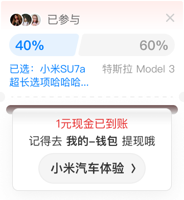

# 20045 · 新调研卡片

## 基本信息

| 项目 | 内容 |
| --- | --- |
| 卡片编号 | 20045 |
| 设计编号 | 20045 |
| 研发编号 | 20045 |
| 正式名称 | 新调研卡片 |
| 基于卡片 | 无明确继承关系 |
| 分类 | 首页双列 |
| 平台规则 | 默认跨端共用，例外待确认 |
| 生命周期 | 使用中（默认假设） |
| 档案状态 | 未人工确认 |
| Figma 来源 | [打开卡片节点](https://www.figma.com/design/bAgan5FT4BJsOkwGpIeGVM/?node-id=4149-24089) |
| 最后修改版本 | 2026.09.01-r2 |

## Figma 备注（不属于卡片画面）

以下内容来自卡片旁的设计说明，只用于理解用途、状态和变更；不会合入卡片预览。

| 备注类型 | 原始备注 |
| --- | --- |
| unclassified | 初始态 |
| change-detail | 初始-常规          11.1.40普通样式增加推荐理由           品牌 |
| unclassified | 超长 |
| state-or-condition | 初始-带奖励  配置按钮图片（和上版本一致） 焦点图尺寸210x210 按钮图尺寸198x96  普通按钮状态同下 |
| unclassified | 终态高度和初始态保持一致 |
| unclassified | 极限百分比 |
| unclassified | 进度条需要有个最小的宽度能够展示完整的百分数 |
| unclassified | 终态-有奖励已绑定、跳转 |
| unclassified | 终态 红色选择 |
| unclassified | 终态-无奖励 |
| unclassified | 终态-无奖励有跳转 |
| unclassified | 终态-无投票有跳转 |
| unclassified | 终态-无投票无跳转 |
| state-or-condition | 暗色 |

## 卡片本体与示例

预览源节点：4149:24089。卡片本体只取 Frame、Component、Component Set 或 Instance；外部编号标题与备注不进入预览。

| 示例 | 节点名称 | 节点类型 | 尺寸 | Node ID |
| --- | --- | --- | --- | --- |
| 2 | 39036 | COMPONENT_SET | 220 × 755 | 5274:29458 |
| 3 | 39036 | FRAME | 180 × 255 | 4149:23906 |
| 4 | 39036 | INSTANCE | 180 × 237 | 4149:23944 |
| 6 | 39036 | FRAME | 180 × 196 | 4149:23951 |
| 6 | Frame 2036092362 | FRAME | 131 × 96 | 4149:23979 |
| 6 | Frame 2036092361 | FRAME | 293 × 60 | 4149:23985 |
| 7 | 39036 | FRAME | 180 × 196 | 4149:23990 |
| 7 | Frame 2036092365 | FRAME | 366 × 123 | 4149:24016 |
| 8 | 39036 | FRAME | 180 × 196 | 4149:24028 |
| 9 | 39037 | FRAME | 180 × 196 | 4149:24057 |
| 10 | 20045-ios | INSTANCE | 180 × 196 | 4149:24089 |
| 11 | 39037 | INSTANCE | 180 × 196 | 4149:24092 |
| 12 | 39037 | INSTANCE | 180 × 196 | 4149:24095 |
| 13 | 39037 | INSTANCE | 180 × 196 | 4149:24098 |
| 14 | 39037 | INSTANCE | 180 × 196 | 4149:24101 |
| 15 | 39037 | INSTANCE | 180 × 196 | 4149:24104 |
| 16 | 39036 | INSTANCE | 180 × 218 | 4149:24107 |
| 16 | 39037 | FRAME | 180 × 218 | 4149:24108 |
| 16 | 39038 | FRAME | 180 × 218 | 4149:24140 |

## 权威编号来源

| Figma 页面 | 区域 | 平台 | 来源 |
| --- | --- | --- | --- |
| 首页 | 首页双列-02 | shared-or-unspecified | [编号标题](https://www.figma.com/design/bAgan5FT4BJsOkwGpIeGVM/?node-id=4149-23897) |

## 使用说明

- 使用目的：待补充
- 适用场景：待补充
- 不适用场景：待补充
- 负责人：待补充

## 状态与变体

当前提取状态：not-scanned

| 状态名称 | Figma 原始名称 | 节点 | 尺寸 |
| --- | --- | --- | --- |
| 暂未完成状态提取 | — | — | — |

## 页面使用关系

| 页面 | 证据等级 | 证据节点 | 来源 |
| --- | --- | --- | --- |
| 暂无页面关系 | — | — | — |

## 相似卡片与差异

- 相似卡片：待补充
- 主要差异：待补充

## 待确认问题

- 暂无已记录问题。

## AI 使用限制

- 未人工确认的用途、状态含义和相似差异不得自行补猜。
- 编号以页面中的卡片字号标题为准，不能因为组件或 Frame 仍沿用旧名称而改号。
- 设计备注属于知识说明，不属于卡片本体，不得渲染进卡片预览。
- Figma 可追溯只代表有强证据，不等于已经由设计确认。
- 长期无人确认时继续保留本档案，不自动删除或废弃。
