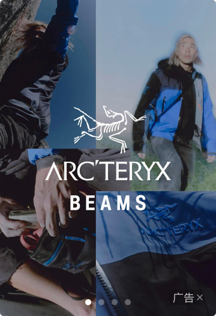

# 23004 · 双列banner运营位

## 基本信息

| 项目 | 内容 |
| --- | --- |
| 卡片编号 | 23004 |
| 设计编号 | 23004 |
| 研发编号 | 23004 |
| 正式名称 | 双列banner运营位 |
| 基于卡片 | 无明确继承关系 |
| 分类 | 首页双列 |
| 平台规则 | 默认跨端共用，例外待确认 |
| 生命周期 | 使用中（默认假设） |
| 档案状态 | 未人工确认 |
| Figma 来源 | [打开卡片节点](https://www.figma.com/design/bAgan5FT4BJsOkwGpIeGVM/?node-id=5-269) |
| 最后修改版本 | 2026.09.01-r2 |

## Figma 备注（不属于卡片画面）

以下内容来自卡片旁的设计说明，只用于理解用途、状态和变更；不会合入卡片预览。

| 备注类型 | 原始备注 |
| --- | --- |
| state-or-condition | 常规 |
| unclassified | adx |

## 卡片本体与示例

预览源节点：5:269。卡片本体只取 Frame、Component、Component Set 或 Instance；外部编号标题与备注不进入预览。

| 示例 | 节点名称 | 节点类型 | 尺寸 | Node ID |
| --- | --- | --- | --- | --- |
| 1 | card/23004 | COMPONENT | 180 × 263 | 5:269 |
| 2 | card/23004-adx | INSTANCE | 180 × 263 | 7:159 |

## 权威编号来源

| Figma 页面 | 区域 | 平台 | 来源 |
| --- | --- | --- | --- |
| 首页 | 首页双列广告 | shared-or-unspecified | [编号标题](https://www.figma.com/design/bAgan5FT4BJsOkwGpIeGVM/?node-id=7-154) |

## 使用说明

- 使用目的：待补充
- 适用场景：待补充
- 不适用场景：待补充
- 负责人：待补充

## 状态与变体

当前提取状态：not-scanned

| 状态名称 | Figma 原始名称 | 节点 | 尺寸 |
| --- | --- | --- | --- |
| 暂未完成状态提取 | — | — | — |

## 页面使用关系

| 页面 | 证据等级 | 证据节点 | 来源 |
| --- | --- | --- | --- |
| 1.1-首页-首页-默认态 | Figma 可追溯 | card/23004 | [打开 Figma](https://www.figma.com/design/lrTnmEfWndqzFHY2kAqgHN/v11.1.95-%E6%96%B0%E7%89%88%E6%9C%AC%E6%B1%87%E6%80%BB?node-id=22135-2297) |
| 5.3-首页-换肤-常规 | Figma 可追溯 | card/23004 | [打开 Figma](https://www.figma.com/design/lrTnmEfWndqzFHY2kAqgHN/v11.1.95-%E6%96%B0%E7%89%88%E6%9C%AC%E6%B1%87%E6%80%BB?node-id=22135-2454) |
| 1.6-首页-吸顶态 | Figma 可追溯 | card/23004 | [打开 Figma](https://www.figma.com/design/lrTnmEfWndqzFHY2kAqgHN/v11.1.95-%E6%96%B0%E7%89%88%E6%9C%AC%E6%B1%87%E6%80%BB?node-id=22135-2548) |
| 1.2-首页-深色 | Figma 可追溯 | card/23004 | [打开 Figma](https://www.figma.com/design/lrTnmEfWndqzFHY2kAqgHN/v11.1.95-%E6%96%B0%E7%89%88%E6%9C%AC%E6%B1%87%E6%80%BB?node-id=22193-10518) |
| 1.5-首页-全部兴趣 | Figma 可追溯 | card/23004 | [打开 Figma](https://www.figma.com/design/lrTnmEfWndqzFHY2kAqgHN/v11.1.95-%E6%96%B0%E7%89%88%E6%9C%AC%E6%B1%87%E6%80%BB?node-id=22193-13624) |
| 1.7-首页-品牌Logo支持 | Figma 可追溯 | card/23004 | [打开 Figma](https://www.figma.com/design/lrTnmEfWndqzFHY2kAqgHN/v11.1.95-%E6%96%B0%E7%89%88%E6%9C%AC%E6%B1%87%E6%80%BB?node-id=22193-14662) |
| 4.1-首页-下拉刷新-默认态 | Figma 可追溯 | card/23004 | [打开 Figma](https://www.figma.com/design/lrTnmEfWndqzFHY2kAqgHN/v11.1.95-%E6%96%B0%E7%89%88%E6%9C%AC%E6%B1%87%E6%80%BB?node-id=22205-14132) |
| 4.2-首页-下拉刷新-数据展示 | Figma 可追溯 | card/23004 | [打开 Figma](https://www.figma.com/design/lrTnmEfWndqzFHY2kAqgHN/v11.1.95-%E6%96%B0%E7%89%88%E6%9C%AC%E6%B1%87%E6%80%BB?node-id=22205-14722) |
| 4.3-首页-下拉刷新-每日首次刷新 | Figma 可追溯 | card/23004 | [打开 Figma](https://www.figma.com/design/lrTnmEfWndqzFHY2kAqgHN/v11.1.95-%E6%96%B0%E7%89%88%E6%9C%AC%E6%B1%87%E6%80%BB?node-id=22205-15334) |
| 4.4-首页-下拉刷新-每日首次刷新-无占比 | Figma 可追溯 | card/23004 | [打开 Figma](https://www.figma.com/design/lrTnmEfWndqzFHY2kAqgHN/v11.1.95-%E6%96%B0%E7%89%88%E6%9C%AC%E6%B1%87%E6%80%BB?node-id=22205-16034) |
| 5.2-首页-商业化-换肤浅色 | Figma 可追溯 | card/23004 | [打开 Figma](https://www.figma.com/design/lrTnmEfWndqzFHY2kAqgHN/v11.1.95-%E6%96%B0%E7%89%88%E6%9C%AC%E6%B1%87%E6%80%BB?node-id=22205-17388) |
| 5.1-首页-商业化-大Banner深色 | Figma 可追溯 | card/23004 | [打开 Figma](https://www.figma.com/design/lrTnmEfWndqzFHY2kAqgHN/v11.1.95-%E6%96%B0%E7%89%88%E6%9C%AC%E6%B1%87%E6%80%BB?node-id=22205-18086) |
| 5.5-首页-商业化-巨幕广告TopSearch | Figma 可追溯 | card/23004 | [打开 Figma](https://www.figma.com/design/lrTnmEfWndqzFHY2kAqgHN/v11.1.95-%E6%96%B0%E7%89%88%E6%9C%AC%E6%B1%87%E6%80%BB?node-id=22205-18977) |
| 5.4-首页-商业化-换肤状态下巨幕广告 | Figma 可追溯 | card/23004 | [打开 Figma](https://www.figma.com/design/lrTnmEfWndqzFHY2kAqgHN/v11.1.95-%E6%96%B0%E7%89%88%E6%9C%AC%E6%B1%87%E6%80%BB?node-id=22205-19594) |
| 3.1-首页-引导 | Figma 可追溯 | card/23004 | [打开 Figma](https://www.figma.com/design/lrTnmEfWndqzFHY2kAqgHN/v11.1.95-%E6%96%B0%E7%89%88%E6%9C%AC%E6%B1%87%E6%80%BB?node-id=22205-31330) |
| 6.1-首页-底部Tab说明-首页-默认态 | Figma 可追溯 | card/23004 | [打开 Figma](https://www.figma.com/design/lrTnmEfWndqzFHY2kAqgHN/v11.1.95-%E6%96%B0%E7%89%88%E6%9C%AC%E6%B1%87%E6%80%BB?node-id=22230-64261) |
| 6.2-首页-底部Tab说明-深色 | Figma 可追溯 | card/23004 | [打开 Figma](https://www.figma.com/design/lrTnmEfWndqzFHY2kAqgHN/v11.1.95-%E6%96%B0%E7%89%88%E6%9C%AC%E6%B1%87%E6%80%BB?node-id=22230-64291) |
| 底部tab-常规 | Figma 可追溯 | card/23004 | [打开 Figma](https://www.figma.com/design/lrTnmEfWndqzFHY2kAqgHN/v11.1.95-%E6%96%B0%E7%89%88%E6%9C%AC%E6%B1%87%E6%80%BB?node-id=22230-69163) |
| 底部tab深色 | Figma 可追溯 | card/23004 | [打开 Figma](https://www.figma.com/design/lrTnmEfWndqzFHY2kAqgHN/v11.1.95-%E6%96%B0%E7%89%88%E6%9C%AC%E6%B1%87%E6%80%BB?node-id=22230-69193) |
| 深色背景换肤-吸顶态 | Figma 可追溯 | card/23004 | [打开 Figma](https://www.figma.com/design/lrTnmEfWndqzFHY2kAqgHN/v11.1.95-%E6%96%B0%E7%89%88%E6%9C%AC%E6%B1%87%E6%80%BB?node-id=22363-70258) |
| 浅色背景换肤-吸顶态 | Figma 可追溯 | card/23004 | [打开 Figma](https://www.figma.com/design/lrTnmEfWndqzFHY2kAqgHN/v11.1.95-%E6%96%B0%E7%89%88%E6%9C%AC%E6%B1%87%E6%80%BB?node-id=22363-70778) |
| 安卓端带虚拟按键 | Figma 可追溯 | card/23004 | [打开 Figma](https://www.figma.com/design/lrTnmEfWndqzFHY2kAqgHN/v11.1.95-%E6%96%B0%E7%89%88%E6%9C%AC%E6%B1%87%E6%80%BB?node-id=22407-85257) |
| 安卓端带桌面显示器 | Figma 可追溯 | card/23004 | [打开 Figma](https://www.figma.com/design/lrTnmEfWndqzFHY2kAqgHN/v11.1.95-%E6%96%B0%E7%89%88%E6%9C%AC%E6%B1%87%E6%80%BB?node-id=22407-93087) |
| 1.1-首页-首页-默认态 | Figma 可追溯 | card/23004 | [打开 Figma](https://www.figma.com/design/lrTnmEfWndqzFHY2kAqgHN/v11.1.95-%E6%96%B0%E7%89%88%E6%9C%AC%E6%B1%87%E6%80%BB?node-id=22552-19089) |
| 1.6-首页-吸顶态 | Figma 可追溯 | card/23004 | [打开 Figma](https://www.figma.com/design/lrTnmEfWndqzFHY2kAqgHN/v11.1.95-%E6%96%B0%E7%89%88%E6%9C%AC%E6%B1%87%E6%80%BB?node-id=22552-19287) |
| 订阅成功提示toast-订阅成功 | Figma 可追溯 | card/23004 | [打开 Figma](https://www.figma.com/design/lrTnmEfWndqzFHY2kAqgHN/v11.1.95-%E6%96%B0%E7%89%88%E6%9C%AC%E6%B1%87%E6%80%BB?node-id=22752-186951) |
| feed | Figma 可追溯 | card/23004 | [打开 Figma](https://www.figma.com/design/lrTnmEfWndqzFHY2kAqgHN/v11.1.95-%E6%96%B0%E7%89%88%E6%9C%AC%E6%B1%87%E6%80%BB?node-id=22752-194283) |
| feed | Figma 可追溯 | card/23004 | [打开 Figma](https://www.figma.com/design/lrTnmEfWndqzFHY2kAqgHN/v11.1.95-%E6%96%B0%E7%89%88%E6%9C%AC%E6%B1%87%E6%80%BB?node-id=22752-194932) |
| feed | Figma 可追溯 | card/23004 | [打开 Figma](https://www.figma.com/design/lrTnmEfWndqzFHY2kAqgHN/v11.1.95-%E6%96%B0%E7%89%88%E6%9C%AC%E6%B1%87%E6%80%BB?node-id=22752-195501) |
| feed | Figma 可追溯 | card/23004 | [打开 Figma](https://www.figma.com/design/lrTnmEfWndqzFHY2kAqgHN/v11.1.95-%E6%96%B0%E7%89%88%E6%9C%AC%E6%B1%87%E6%80%BB?node-id=22752-196071) |
| feed | Figma 可追溯 | card/23004 | [打开 Figma](https://www.figma.com/design/lrTnmEfWndqzFHY2kAqgHN/v11.1.95-%E6%96%B0%E7%89%88%E6%9C%AC%E6%B1%87%E6%80%BB?node-id=22752-196640) |
| loading背景色区域 | Figma 可追溯 | card/23004 | [打开 Figma](https://www.figma.com/design/lrTnmEfWndqzFHY2kAqgHN/v11.1.95-%E6%96%B0%E7%89%88%E6%9C%AC%E6%B1%87%E6%80%BB?node-id=23185-242922) |
| loading背景色区域 | Figma 可追溯 | card/23004 | [打开 Figma](https://www.figma.com/design/lrTnmEfWndqzFHY2kAqgHN/v11.1.95-%E6%96%B0%E7%89%88%E6%9C%AC%E6%B1%87%E6%80%BB?node-id=23185-243644) |
| 回顶部 | Figma 可追溯 | card/23004 | [打开 Figma](https://www.figma.com/design/lrTnmEfWndqzFHY2kAqgHN/v11.1.95-%E6%96%B0%E7%89%88%E6%9C%AC%E6%B1%87%E6%80%BB?node-id=23209-252264) |
| 4.1-首页-下拉刷新-默认态 | Figma 可追溯 | card/23004 | [打开 Figma](https://www.figma.com/design/lrTnmEfWndqzFHY2kAqgHN/v11.1.95-%E6%96%B0%E7%89%88%E6%9C%AC%E6%B1%87%E6%80%BB?node-id=23209-268687) |
| 4.1-首页-下拉刷新-默认态 | Figma 可追溯 | card/23004 | [打开 Figma](https://www.figma.com/design/lrTnmEfWndqzFHY2kAqgHN/v11.1.95-%E6%96%B0%E7%89%88%E6%9C%AC%E6%B1%87%E6%80%BB?node-id=23209-269306) |
| 4.1-首页-下拉刷新-默认态 | Figma 可追溯 | card/23004 | [打开 Figma](https://www.figma.com/design/lrTnmEfWndqzFHY2kAqgHN/v11.1.95-%E6%96%B0%E7%89%88%E6%9C%AC%E6%B1%87%E6%80%BB?node-id=23209-269929) |
| 4.1-首页-下拉刷新-默认态 | Figma 可追溯 | card/23004 | [打开 Figma](https://www.figma.com/design/lrTnmEfWndqzFHY2kAqgHN/v11.1.95-%E6%96%B0%E7%89%88%E6%9C%AC%E6%B1%87%E6%80%BB?node-id=23209-270549) |
| 4.1-首页-下拉刷新-默认态 | Figma 可追溯 | card/23004 | [打开 Figma](https://www.figma.com/design/lrTnmEfWndqzFHY2kAqgHN/v11.1.95-%E6%96%B0%E7%89%88%E6%9C%AC%E6%B1%87%E6%80%BB?node-id=23232-273394) |
| 首页-我的新内容提示 | Figma 可追溯 | card/23004 | [打开 Figma](https://www.figma.com/design/lrTnmEfWndqzFHY2kAqgHN/v11.1.95-%E6%96%B0%E7%89%88%E6%9C%AC%E6%B1%87%E6%80%BB?node-id=23279-272130) |
| 3.1-首页-引导 | Figma 可追溯 | card/23004 | [打开 Figma](https://www.figma.com/design/lrTnmEfWndqzFHY2kAqgHN/v11.1.95-%E6%96%B0%E7%89%88%E6%9C%AC%E6%B1%87%E6%80%BB?node-id=23315-325155) |
| 3.1-首页-引导 | Figma 可追溯 | card/23004 | [打开 Figma](https://www.figma.com/design/lrTnmEfWndqzFHY2kAqgHN/v11.1.95-%E6%96%B0%E7%89%88%E6%9C%AC%E6%B1%87%E6%80%BB?node-id=23315-330587) |
| 订阅成功提示toast-取消订阅成功 | Figma 可追溯 | card/23004 | [打开 Figma](https://www.figma.com/design/lrTnmEfWndqzFHY2kAqgHN/v11.1.95-%E6%96%B0%E7%89%88%E6%9C%AC%E6%B1%87%E6%80%BB?node-id=23375-339643) |

## 相似卡片与差异

- 相似卡片：待补充
- 主要差异：待补充

## 待确认问题

- 暂无已记录问题。

## AI 使用限制

- 未人工确认的用途、状态含义和相似差异不得自行补猜。
- 编号以页面中的卡片字号标题为准，不能因为组件或 Frame 仍沿用旧名称而改号。
- 设计备注属于知识说明，不属于卡片本体，不得渲染进卡片预览。
- Figma 可追溯只代表有强证据，不等于已经由设计确认。
- 长期无人确认时继续保留本档案，不自动删除或废弃。
