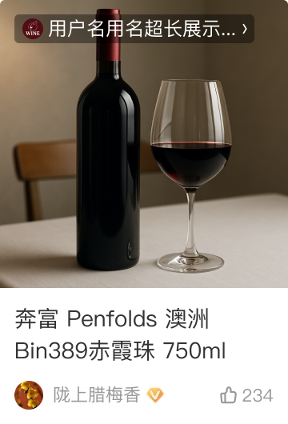

# 24075 · 文章笔记卡片

## 基本信息

| 项目 | 内容 |
| --- | --- |
| 卡片编号 | 24075 |
| 设计编号 | 24075 |
| 研发编号 | 24075 |
| 正式名称 | 文章笔记卡片 |
| 基于卡片 | 无明确继承关系 |
| 分类 | 关注 |
| 平台规则 | 默认跨端共用，例外待确认 |
| 生命周期 | 使用中（默认假设） |
| 档案状态 | 未人工确认 |
| Figma 来源 | [打开卡片节点](https://www.figma.com/design/bAgan5FT4BJsOkwGpIeGVM/?node-id=361-16963) |
| 最后修改版本 | 2026.09.01-r2 |

## Figma 备注（不属于卡片画面）

以下内容来自卡片旁的设计说明，只用于理解用途、状态和变更；不会合入卡片预览。

| 备注类型 | 原始备注 |
| --- | --- |
| change-detail | 1、在22001基础上增加用户角标，当为用户角标时，左下角不显示作者 2、当为关注商品的内容时，显示下方商品信息 3、其他状态同22001 |
| state-or-condition | 常规标签 |
| unclassified | 相关推荐 |
| change-detail | v11.1.25新增 |
| change-detail | v11.1.35新增AIGC 注意：头像组合时，头像是15，比常规头像小 |
| unclassified | 头像少时 |
| state-or-condition | 只有1个来源时，头像是18，和常规头像一样 |
| state-or-condition | 兜底 头像是18，和常规头像一样 |
| change-detail | v11.1.53 AIGC调整，mugc去掉头像 |
| unclassified | v11.1.60标题前加特殊标签 |
| unclassified | 4字宽度示意 |
| unclassified | 3字宽度示意 |
| unclassified | 2字宽度示意 |
| unclassified | 标题显示 |
| unclassified | 三个字 |
| unclassified | 双字 |
| state-or-condition | 加载占位图 常规&暗色 3&4字的原来20040有 |

## 卡片本体与示例

预览源节点：361:16963。卡片本体只取 Frame、Component、Component Set 或 Instance；外部编号标题与备注不进入预览。

| 示例 | 节点名称 | 节点类型 | 尺寸 | Node ID |
| --- | --- | --- | --- | --- |
| 1 | card/24075 | COMPONENT | 180 × 265 | 361:16963 |
| 2 | card/24075 | FRAME | 180 × 310 | 361:17083 |
| 3 | card/24075 | FRAME | 180 × 289 | 361:17316 |
| 4 | card/24075 | FRAME | 180 × 265 | 361:17403 |
| 5 | card/24075 | INSTANCE | 180 × 265 | 1448:26165 |
| 6 | card/24075 | INSTANCE | 180 × 265 | 4590:42785 |
| 7 | card/24075 | INSTANCE | 180 × 265 | 4590:42885 |
| 8 | card/24075 | INSTANCE | 180 × 265 | 4590:42980 |
| 9 | card/24075 | INSTANCE | 180 × 265 | 4590:43296 |
| 10 | card/24075 | FRAME | 180 × 262 | 6363:48847 |
| 11 | card/24075 | INSTANCE | 180 × 265 | 7447:39695 |

## 权威编号来源

| Figma 页面 | 区域 | 平台 | 来源 |
| --- | --- | --- | --- |
| 关注 | 关注 | shared-or-unspecified | [编号标题](https://www.figma.com/design/bAgan5FT4BJsOkwGpIeGVM/?node-id=361-3220) |

## 使用说明

- 使用目的：待补充
- 适用场景：待补充
- 不适用场景：待补充
- 负责人：待补充

## 状态与变体

当前提取状态：not-scanned

| 状态名称 | Figma 原始名称 | 节点 | 尺寸 |
| --- | --- | --- | --- |
| 暂未完成状态提取 | — | — | — |

## 页面使用关系

| 页面 | 证据等级 | 证据节点 | 来源 |
| --- | --- | --- | --- |
| 暂无页面关系 | — | — | — |

## 相似卡片与差异

- 相似卡片：待补充
- 主要差异：待补充

## 待确认问题

- 暂无已记录问题。

## AI 使用限制

- 未人工确认的用途、状态含义和相似差异不得自行补猜。
- 编号以页面中的卡片字号标题为准，不能因为组件或 Frame 仍沿用旧名称而改号。
- 设计备注属于知识说明，不属于卡片本体，不得渲染进卡片预览。
- Figma 可追溯只代表有强证据，不等于已经由设计确认。
- 长期无人确认时继续保留本档案，不自动删除或废弃。
