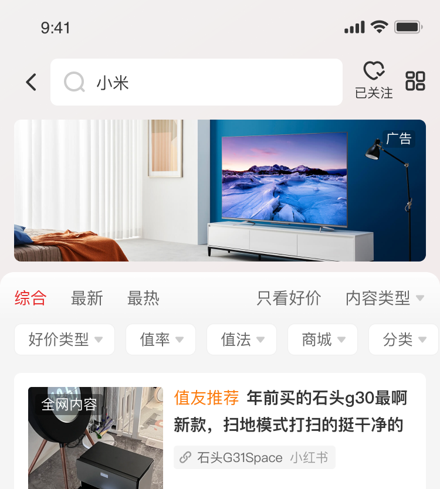

# 25063 · 卡片 25063

## 基本信息

| 项目 | 内容 |
| --- | --- |
| 卡片编号 | 25063 |
| 设计编号 | 25063 |
| 研发编号 | 25063 |
| 正式名称 | 卡片 25063 |
| 基于卡片 | 无明确继承关系 |
| 分类 | 搜索 |
| 平台规则 | 默认跨端共用，例外待确认 |
| 生命周期 | 使用中（默认假设） |
| 档案状态 | 未人工确认 |
| Figma 来源 | [打开卡片节点](https://www.figma.com/design/bAgan5FT4BJsOkwGpIeGVM/?node-id=1043-9820) |
| 最后修改版本 | 2026.09.01-r2 |

## Figma 备注（不属于卡片画面）

以下内容来自卡片旁的设计说明，只用于理解用途、状态和变更；不会合入卡片预览。

| 备注类型 | 原始备注 |
| --- | --- |
| state-or-condition | 搜索结果品牌号置顶卡片轻换肤中banner样式            搜索结果品牌号置顶卡片轻换肤中视频卡片-常规样式           搜索结果品牌号置顶卡片轻换肤中视频卡片-静音播放中样式            搜索结果品牌号置顶卡片轻换肤中视频卡片-非静音播放中样式           搜索结果品牌号置顶卡片轻换肤中视频卡片-使用流量播放提示样式            搜索结果品牌号置顶卡片轻换肤中视频卡片-网络异常样式 |
| state-or-condition | 常规  无品牌信息 |
| unclassified | 浅色换肤 |
| unclassified | 深色换肤 |
| unclassified | The Creative Life |
| unclassified | TCL |
| usage-detail | 4175人关注 |
| unclassified | 1.1K |
| unclassified | 在售商品 |
| unclassified | 15.1K |
| unclassified | 好价 |
| unclassified | 液晶电视电视 |
| unclassified | 液晶电视65K |
| unclassified | 好价类型 |
| unclassified | 参考文章 |
| unclassified | 一直都是小可爱 |
| unclassified | 显示器怎么选？2023双十一显示器好价推荐 |
| unclassified | 8.8k |
| unclassified | 一直都是小可… |
| unclassified | 超长显示超长显示超长显示超长显示超长显… |
| unclassified | 有用 10 |
| unclassified | 植萃舒缓亮妍精华露 |
| unclassified | 植萃舒缓精华液 |
| unclassified | 全面提升肌肤的健康 |
| unclassified | SKINCEUTICALS/修丽可 |
| unclassified | 华为手机手机 |
| usage-detail | 华为突然官宣：1月19日，新品正式发布 |
| unclassified | 推荐商品 |
| usage-detail | 选择显示器时,需要考虑以下几个方面: 1.需求：根据自己的使用场景，如办公、游戏或专业工作，选择合适的显示器。例如，办公显示器应该关注分辨率高一，如2K分辨率，画面越细腻，文字更清晰，对眼睛好。 2.尺寸:显示器的尺寸主要包括24寸、27寸和32等。 24寸适合1080P分辨率,27寸适合2K分辨率,32寸通常 适合4K分辨率。 3.分辨率:分辨率决定了显示器能展示图像的清晰程度。 一般来讲,分辨率越高,画面越细腻,人们会感觉"清晰 度"越高。 4.色域:色域是对一种颜色进行编码的方法,也指一个技 术系统能够产生的颜色的总和。色域越大,越能表现更鲜 |
| unclassified | 商品概况: 已检索到的TOP好价内容均为vivoX100系列手机的售卖信息，包括vivoX100和vivo X100Pro两个型号，颜色有辰夜黑、白月光、落日橙等，存储容量有 12GB+256GB、16GB+512GB等配置。 价格概况: 1.vivoX10012GB+256GB的价格为3899元,需用券且晒单返50元E卡后 2.vivoX100Pro16GB+512GB的价格在4908元至5489元之间,具体价格取决于颜 色和购买渠道。 |
| unclassified | 华为充电宝可以带上飞机以下充电宝上飞注意事项： |
| unclassified | 额定能量限制：额定能量不超过100Wh的充电宝，无需航空公司批准,可直接带上飞机 |
| unclassified | 携带方式：充电宝不可办理托运，必须放在手提行李中或随身携带。 |
| unclassified | vivo  X100   12GB + 256GB白月光 |
| unclassified | 3789元(需用券) |
| unclassified | 拼多多 |
| unclassified | 网络异常请重试 |
| unclassified | 新 iPhone 在招手，等你快入手 |
| unclassified | 那些年我送老婆的礼物——盘点500元以内品质/使用俱佳的精致好礼 |
| unclassified | 常卖价 |
| unclassified | ¥3999 |
| unclassified | 11.23 |
| unclassified | 5399元起 |
| unclassified | 近30日更新90篇内容 |
| unclassified | 三星手机 |
| unclassified | 一句话描述一句话描述一句话描述3… |
| unclassified | 大户型适用 |
| unclassified | 自动集尘 |
| unclassified | 明天10点开抢·限量10件 |
| unclassified | 限量抢·限量10件 |

## 卡片本体与示例

预览源节点：1043:9820。卡片本体只取 Frame、Component、Component Set 或 Instance；外部编号标题与备注不进入预览。

| 示例 | 节点名称 | 节点类型 | 尺寸 | Node ID |
| --- | --- | --- | --- | --- |
| 1 | card/25063 | COMPONENT_SET | 391 × 1962 | 411:9084 |
| 1 | 25065 | COMPONENT | 375 × 659 | 1043:9704 |
| 1 | 25067 | FRAME | 375 × 736 | 4237:22055 |
| 1 | 25064 | COMPONENT | 375 × 659 | 1043:9762 |
| 1 | 25066 | FRAME | 375 × 659 | 4237:21125 |
| 1 | 25063 | COMPONENT | 375 × 417 | 1043:9820 |
| 1 | Frame 63 | INSTANCE | 87 × 88 | 1037:8879 |
| 1 | Frame 64 | INSTANCE | 87 × 88 | 1037:8882 |
| 2 | Frame 2036092051 | FRAME | 124 × 14 | 1039:8892 |
| 2 | Frame 2036092052 | FRAME | 145 × 14 | 1039:8894 |
| 3 | Frame 2036092055 | INSTANCE | 60 × 27 | 1042:19505 |
| 3 | Frame 2036092056 | INSTANCE | 60 × 27 | 1042:19511 |
| 3 | Frame 2036092057 | INSTANCE | 60 × 27 | 1042:19516 |
| 3 | Frame 2036092058 | INSTANCE | 60 × 27 | 1042:19521 |
| 4 | triangle-down-fill | INSTANCE | 10 × 10 | 1042:19500 |
| 6 | Frame 1 | FRAME | 587 × 38 | I135:12078;5:28 |
| 6 | 入库端 | FRAME | 58 × 16 | I135:12078;5:32 |
| 7 | 10.0蒙层标签 | INSTANCE | 28 × 15 | 135:12022 |
| 8 | 10.0蒙层标签 | INSTANCE | 28 × 15 | 135:12060 |
| 9 | 10.0蒙层标签 | INSTANCE | 28 × 15 | 135:12697 |
| 10 | Frame 1 | FRAME | 246 × 38 | I141:1984;5:28 |
| 10 | 入库端 | FRAME | 58 × 16 | I141:1984;5:32 |
| 15 | Frame 1 | FRAME | 151 × 38 | I196:2774;5:28 |
| 15 | 入库端 | FRAME | 58 × 16 | I196:2774;5:32 |
| 18 | 关注按钮 | INSTANCE | 57 × 24 | 200:12813 |
| 19 | Frame 1 | FRAME | 151 × 38 | I205:16701;5:28 |
| 19 | 入库端 | FRAME | 58 × 16 | I205:16701;5:32 |
| 21 | Frame 1 | FRAME | 151 × 38 | I205:23205;5:28 |
| 21 | 入库端 | FRAME | 58 × 16 | I205:23205;5:32 |
| 24 | Frame 1 | FRAME | 149 × 38 | I269:11677;5:28 |
| 24 | 入库端 | FRAME | 58 × 16 | I269:11677;5:32 |
| 28 | controls/labels/search/Property 45 | INSTANCE | 63 × 16 | 269:5561 |
| 30 | Frame 1 | FRAME | 151 × 38 | I280:29261;5:28 |
| 30 | 入库端 | FRAME | 58 × 16 | I280:29261;5:32 |
| 31 | refresh-bold | INSTANCE | 18 × 18 | 280:24708 |
| 33 | Frame 1 | FRAME | 151 × 38 | I295:25261;5:28 |
| 33 | 入库端 | FRAME | 58 × 16 | I295:25261;5:32 |
| 35 | Frame 1 | FRAME | 151 × 38 | I310:16907;5:28 |
| 35 | 入库端 | FRAME | 58 × 16 | I310:16907;5:32 |
| 38 | 类型=好价 | COMPONENT | 34 × 18 | 387:12135 |
| 38 | 类型=文章 | COMPONENT | 34 × 18 | 387:12136 |
| 38 | 类型=商品 | COMPONENT | 34 × 18 | 387:12137 |
| 38 | 类型=新品 | COMPONENT | 34 × 18 | 387:12138 |
| 39 | Frame 1 | FRAME | 370 × 38 | I576:9421;5:28 |
| 39 | 入库端 | FRAME | 58 × 16 | I576:9421;5:32 |
| 41 | Frame 1 | FRAME | 339 × 38 | I590:8940;5:28 |
| 41 | 入库端 | FRAME | 58 × 16 | I590:8940;5:32 |
| 43 | Frame 1 | FRAME | 293 × 38 | I2690:25208;5:28 |
| 43 | 入库端 | FRAME | 58 × 16 | I2690:25208;5:32 |

## 权威编号来源

| Figma 页面 | 区域 | 平台 | 来源 |
| --- | --- | --- | --- |
| 搜索 | 搜索-01-ios | ios | [编号标题](https://www.figma.com/design/bAgan5FT4BJsOkwGpIeGVM/?node-id=113-16399) |
| 搜索 | 元素 | shared-or-unspecified | [编号标题](https://www.figma.com/design/bAgan5FT4BJsOkwGpIeGVM/?node-id=1042-19586) |

## 使用说明

- 使用目的：待补充
- 适用场景：待补充
- 不适用场景：待补充
- 负责人：待补充

## 状态与变体

当前提取状态：not-scanned

| 状态名称 | Figma 原始名称 | 节点 | 尺寸 |
| --- | --- | --- | --- |
| 暂未完成状态提取 | — | — | — |

## 页面使用关系

| 页面 | 证据等级 | 证据节点 | 来源 |
| --- | --- | --- | --- |
| 2.2-搜索-品牌-爱好等意图-适配商业化 | Figma 可追溯 | card/25063 | [打开 Figma](https://www.figma.com/design/lrTnmEfWndqzFHY2kAqgHN/v11.1.95-%E6%96%B0%E7%89%88%E6%9C%AC%E6%B1%87%E6%80%BB?node-id=22424-88954) |

## 相似卡片与差异

- 相似卡片：待补充
- 主要差异：待补充

## 待确认问题

- 编号标题右侧缺少可读取的正式卡片名称，请设计补充。

## AI 使用限制

- 未人工确认的用途、状态含义和相似差异不得自行补猜。
- 编号以页面中的卡片字号标题为准，不能因为组件或 Frame 仍沿用旧名称而改号。
- 设计备注属于知识说明，不属于卡片本体，不得渲染进卡片预览。
- Figma 可追溯只代表有强证据，不等于已经由设计确认。
- 长期无人确认时继续保留本档案，不自动删除或废弃。
