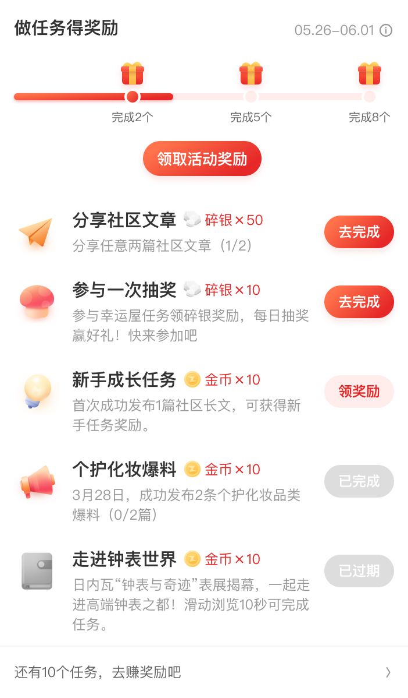

# 31013 · 签到中心累计任务活动模块

## 基本信息

| 项目 | 内容 |
| --- | --- |
| 卡片编号 | 31013 |
| 设计编号 | 31013 |
| 研发编号 | 31013 |
| 正式名称 | 签到中心累计任务活动模块 |
| 基于卡片 | 无明确继承关系 |
| 分类 | 我的 |
| 平台规则 | 默认跨端共用，例外待确认 |
| 生命周期 | 使用中（默认假设） |
| 档案状态 | 未人工确认 |
| Figma 来源 | [打开卡片节点](https://www.figma.com/design/bAgan5FT4BJsOkwGpIeGVM/?node-id=53-5563) |
| 最后修改版本 | 2026.09.01-r2 |

## Figma 备注（不属于卡片画面）

以下内容来自卡片旁的设计说明，只用于理解用途、状态和变更；不会合入卡片预览。

| 备注类型 | 原始备注 |
| --- | --- |
| unclassified | 此样式用于 APP 10.4.45及之后版本 老样式见10.0组件库卡片 26007 |
| state-or-condition | 签到中心-任务卡片-常规类 用于我的-签到中心-累计类活动模块  注：头部累计状态根据任务完成情况展示       任务节点和需完成的任务数根据后台配置显示 |
| state-or-condition | 任务初始状态 |
| state-or-condition | 任务完成阶段奖励（待领取） |

## 卡片本体与示例

预览源节点：53:5563。卡片本体只取 Frame、Component、Component Set 或 Instance；外部编号标题与备注不进入预览。

| 示例 | 节点名称 | 节点类型 | 尺寸 | Node ID |
| --- | --- | --- | --- | --- |
| 1 | card/31013 | COMPONENT | 351 × 599 | 53:5563 |
| 2 | controls/card_3101x/task_active/total | INSTANCE | 351 × 91 | 53:7008 |
| 3 | controls/card_3101x/task_active/total | COMPONENT | 351 × 136 | 53:3039 |

## 权威编号来源

| Figma 页面 | 区域 | 平台 | 来源 |
| --- | --- | --- | --- |
| 我的 | 个人中心-damo | shared-or-unspecified | [编号标题](https://www.figma.com/design/bAgan5FT4BJsOkwGpIeGVM/?node-id=44-8081) |

## 使用说明

- 使用目的：待补充
- 适用场景：待补充
- 不适用场景：待补充
- 负责人：待补充

## 状态与变体

当前提取状态：not-scanned

| 状态名称 | Figma 原始名称 | 节点 | 尺寸 |
| --- | --- | --- | --- |
| 暂未完成状态提取 | — | — | — |

## 页面使用关系

| 页面 | 证据等级 | 证据节点 | 来源 |
| --- | --- | --- | --- |
| 暂无页面关系 | — | — | — |

## 相似卡片与差异

- 相似卡片：待补充
- 主要差异：待补充

## 待确认问题

- 暂无已记录问题。

## AI 使用限制

- 未人工确认的用途、状态含义和相似差异不得自行补猜。
- 编号以页面中的卡片字号标题为准，不能因为组件或 Frame 仍沿用旧名称而改号。
- 设计备注属于知识说明，不属于卡片本体，不得渲染进卡片预览。
- Figma 可追溯只代表有强证据，不等于已经由设计确认。
- 长期无人确认时继续保留本档案，不自动删除或废弃。
