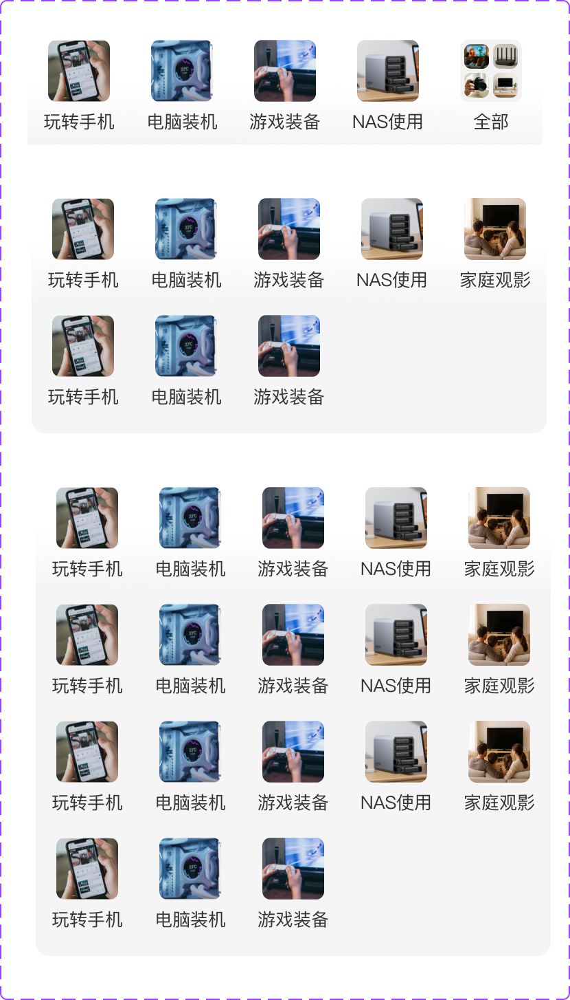

# 33041 · 社区首页子tab金刚区

## 基本信息

| 项目 | 内容 |
| --- | --- |
| 卡片编号 | 33041 |
| 设计编号 | 33041 |
| 研发编号 | 33041 |
| 正式名称 | 社区首页子tab金刚区 |
| 基于卡片 | 无明确继承关系 |
| 分类 | 社区 |
| 平台规则 | 默认跨端共用，例外待确认 |
| 生命周期 | 使用中（默认假设） |
| 档案状态 | 未人工确认 |
| Figma 来源 | [打开卡片节点](https://www.figma.com/design/bAgan5FT4BJsOkwGpIeGVM/?node-id=451-21647) |
| 最后修改版本 | 2026.09.01-r2 |

## Figma 备注（不属于卡片画面）

以下内容来自卡片旁的设计说明，只用于理解用途、状态和变更；不会合入卡片预览。

| 备注类型 | 原始备注 |
| --- | --- |
| usage-detail | 使用位置：社区频道  子tab下icon 子tab icon-全部显示4个 |
| unclassified | 子tab icon-没有全部，第5个展示icon位 |
| unclassified | 子tab icon-全部显示2个 |
| unclassified | 子tab icon-全部显示3个 |

## 卡片本体与示例

预览源节点：451:21647。卡片本体只取 Frame、Component、Component Set 或 Instance；外部编号标题与备注不进入预览。

| 示例 | 节点名称 | 节点类型 | 尺寸 | Node ID |
| --- | --- | --- | --- | --- |
| 1 | 33041 | COMPONENT_SET | 415 × 727 | 451:21647 |
| 2 | 33041 | INSTANCE | 375 × 85 | 294:10807 |
| 3 | 33041 | INSTANCE | 375 × 85 | 312:5374 |
| 4 | 33041 | INSTANCE | 375 × 85 | 312:5398 |

## 权威编号来源

| Figma 页面 | 区域 | 平台 | 来源 |
| --- | --- | --- | --- |
| 社区 | 社区-02 | shared-or-unspecified | [编号标题](https://www.figma.com/design/bAgan5FT4BJsOkwGpIeGVM/?node-id=291-14742) |

## 使用说明

- 使用目的：待补充
- 适用场景：待补充
- 不适用场景：待补充
- 负责人：待补充

## 状态与变体

当前提取状态：not-scanned

| 状态名称 | Figma 原始名称 | 节点 | 尺寸 |
| --- | --- | --- | --- |
| 暂未完成状态提取 | — | — | — |

## 页面使用关系

| 页面 | 证据等级 | 证据节点 | 来源 |
| --- | --- | --- | --- |
| 暂无页面关系 | — | — | — |

## 相似卡片与差异

- 相似卡片：待补充
- 主要差异：待补充

## 待确认问题

- 暂无已记录问题。

## AI 使用限制

- 未人工确认的用途、状态含义和相似差异不得自行补猜。
- 编号以页面中的卡片字号标题为准，不能因为组件或 Frame 仍沿用旧名称而改号。
- 设计备注属于知识说明，不属于卡片本体，不得渲染进卡片预览。
- Figma 可追溯只代表有强证据，不等于已经由设计确认。
- 长期无人确认时继续保留本档案，不自动删除或废弃。
