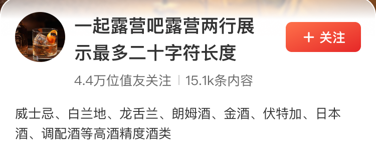

# 37010 · 栏目-头部

## 基本信息

| 项目 | 内容 |
| --- | --- |
| 卡片编号 | 37010 |
| 设计编号 | 37010 |
| 研发编号 | 37010 |
| 正式名称 | 栏目-头部 |
| 基于卡片 | 无明确继承关系 |
| 分类 | 兴趣聚合 |
| 平台规则 | 默认跨端共用，例外待确认 |
| 生命周期 | 使用中（默认假设） |
| 档案状态 | 未人工确认 |
| Figma 来源 | [打开卡片节点](https://www.figma.com/design/bAgan5FT4BJsOkwGpIeGVM/?node-id=282-26898) |
| 最后修改版本 | 2026.09.01-r2 |

## Figma 备注（不属于卡片画面）

以下内容来自卡片旁的设计说明，只用于理解用途、状态和变更；不会合入卡片预览。

| 备注类型 | 原始备注 |
| --- | --- |
| usage-detail | 头部背景图+标题两行+内容关注数据+描述 |
| unclassified | 更新提示 |
| usage-detail | 头部背景图+标题两行+内容关注数据+无描述 |
| usage-detail | 头部背景图+标题两行+无内容关注数据+无描述 |
| usage-detail | 无头部背景图+一行标题+只有关注数+无描述 |
| usage-detail | 无头部背景图+一行标题+无描述  头像、标题、关注按钮，左右居中对齐 |
| usage-detail | 头部背景图+一行标题+内容关注数据+描述  当头部内容与二级tab挨着时， 背景需要有个从上到下的过渡渐变#ffffff（上） - #f5f5f5（下） |
| change-detail | v11.1.10 新增热点评论栏目 无关注按钮状态，标题和下方数据最大长度变大 |

## 卡片本体与示例

预览源节点：282:26898。卡片本体只取 Frame、Component、Component Set 或 Instance；外部编号标题与备注不进入预览。

| 示例 | 节点名称 | 节点类型 | 尺寸 | Node ID |
| --- | --- | --- | --- | --- |
| 1 | card/37010 | COMPONENT | 375 × 155 | 282:26898 |
| 2 | card/37010 | INSTANCE | 375 × 155 | 1587:4474 |
| 3 | card/37010 | INSTANCE | 375 × 100 | 282:26901 |
| 4 | card/37010 | INSTANCE | 375 × 78 | 282:27054 |
| 5 | card/37010 | INSTANCE | 375 × 129 | 282:27322 |
| 6 | card/37010 | INSTANCE | 375 × 74 | 282:27712 |
| 7 | Frame 16 | FRAME | 375 × 140 | 282:29263 |
| 8 | card/37010 | FRAME | 375 × 100 | 282:28801 |
| 9 | card/37010 | FRAME | 375 × 100 | 1587:4389 |

## 权威编号来源

| Figma 页面 | 区域 | 平台 | 来源 |
| --- | --- | --- | --- |
| 兴趣聚合 | 兴趣-前端组件 | shared-or-unspecified | [编号标题](https://www.figma.com/design/bAgan5FT4BJsOkwGpIeGVM/?node-id=282-25934) |

## 使用说明

- 使用目的：待补充
- 适用场景：待补充
- 不适用场景：待补充
- 负责人：待补充

## 状态与变体

当前提取状态：not-scanned

| 状态名称 | Figma 原始名称 | 节点 | 尺寸 |
| --- | --- | --- | --- |
| 暂未完成状态提取 | — | — | — |

## 页面使用关系

| 页面 | 证据等级 | 证据节点 | 来源 |
| --- | --- | --- | --- |
| 暂无页面关系 | — | — | — |

## 相似卡片与差异

- 相似卡片：待补充
- 主要差异：待补充

## 待确认问题

- 暂无已记录问题。

## AI 使用限制

- 未人工确认的用途、状态含义和相似差异不得自行补猜。
- 编号以页面中的卡片字号标题为准，不能因为组件或 Frame 仍沿用旧名称而改号。
- 设计备注属于知识说明，不属于卡片本体，不得渲染进卡片预览。
- Figma 可追溯只代表有强证据，不等于已经由设计确认。
- 长期无人确认时继续保留本档案，不自动删除或废弃。
