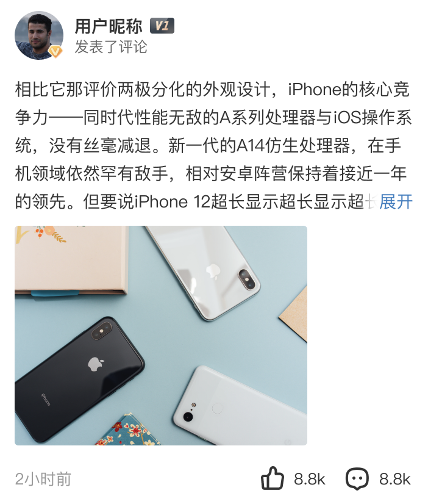

# 37011 · 热点评论卡片

## 基本信息

| 项目 | 内容 |
| --- | --- |
| 卡片编号 | 37011 |
| 设计编号 | 37011 |
| 研发编号 | 37011 |
| 正式名称 | 热点评论卡片 |
| 基于卡片 | 无明确继承关系 |
| 分类 | 兴趣聚合 |
| 平台规则 | 默认跨端共用，例外待确认 |
| 生命周期 | 使用中（默认假设） |
| 档案状态 | 未人工确认 |
| Figma 来源 | [打开卡片节点](https://www.figma.com/design/bAgan5FT4BJsOkwGpIeGVM/?node-id=282-30294) |
| 最后修改版本 | 2026.09.01-r2 |

## Figma 备注（不属于卡片画面）

以下内容来自卡片旁的设计说明，只用于理解用途、状态和变更；不会合入卡片预览。

| 备注类型 | 原始备注 |
| --- | --- |
| change-detail | 卡片宽度调整，内部左右间距调整，头像与下方评论的间距按设计稿来 卡片圆角、图片圆角调整 |
| unclassified | 图片 1:1 |
| unclassified | 图片3:4 |
| unclassified | 无图 |
| unclassified | 站内文章 |
| unclassified | 评论中加链接 获取不到文章链接 链接文章标题一行垂直居中 |

## 卡片本体与示例

预览源节点：282:30294。卡片本体只取 Frame、Component、Component Set 或 Instance；外部编号标题与备注不进入预览。

| 示例 | 节点名称 | 节点类型 | 尺寸 | Node ID |
| --- | --- | --- | --- | --- |
| 1 | card/37011 | COMPONENT | 351 × 413 | 282:30294 |
| 2 | card/37011 | INSTANCE | 351 × 413 | 282:30301 |
| 3 | card/37011 | INSTANCE | 351 × 473 | 282:30552 |
| 4 | card/37011 | INSTANCE | 351 × 224 | 282:30643 |
| 5 | card/37011 | INSTANCE | 351 × 283 | 282:30758 |
| 6 | card/37011 | INSTANCE | 351 × 260 | 282:30841 |

## 权威编号来源

| Figma 页面 | 区域 | 平台 | 来源 |
| --- | --- | --- | --- |
| 兴趣聚合 | 兴趣-前端组件 | shared-or-unspecified | [编号标题](https://www.figma.com/design/bAgan5FT4BJsOkwGpIeGVM/?node-id=282-29267) |

## 使用说明

- 使用目的：待补充
- 适用场景：待补充
- 不适用场景：待补充
- 负责人：待补充

## 状态与变体

当前提取状态：not-scanned

| 状态名称 | Figma 原始名称 | 节点 | 尺寸 |
| --- | --- | --- | --- |
| 暂未完成状态提取 | — | — | — |

## 页面使用关系

| 页面 | 证据等级 | 证据节点 | 来源 |
| --- | --- | --- | --- |
| 暂无页面关系 | — | — | — |

## 相似卡片与差异

- 相似卡片：待补充
- 主要差异：待补充

## 待确认问题

- 暂无已记录问题。

## AI 使用限制

- 未人工确认的用途、状态含义和相似差异不得自行补猜。
- 编号以页面中的卡片字号标题为准，不能因为组件或 Frame 仍沿用旧名称而改号。
- 设计备注属于知识说明，不属于卡片本体，不得渲染进卡片预览。
- Figma 可追溯只代表有强证据，不等于已经由设计确认。
- 长期无人确认时继续保留本档案，不自动删除或废弃。
