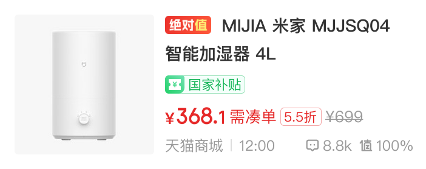

# 39001 · 首页单列好价

## 基本信息

| 项目 | 内容 |
| --- | --- |
| 卡片编号 | 39001 |
| 设计编号 | 39001 |
| 研发编号 | 39001 |
| 正式名称 | 首页单列好价 |
| 基于卡片 | 无明确继承关系 |
| 分类 | 首页单列 |
| 平台规则 | 默认跨端共用，例外待确认 |
| 生命周期 | 使用中（默认假设） |
| 档案状态 | 未人工确认 |
| Figma 来源 | [打开卡片节点](https://www.figma.com/design/bAgan5FT4BJsOkwGpIeGVM/?node-id=2160-14771) |
| 最后修改版本 | 2026.09.01-r2 |

## Figma 备注（不属于卡片画面）

以下内容来自卡片旁的设计说明，只用于理解用途、状态和变更；不会合入卡片预览。

| 备注类型 | 原始备注 |
| --- | --- |
| relationship-or-mapping | 常规 对应双列卡片：20001         同款好价        相似好价 对应双列卡片：20020 |
| unclassified | 纯文本 |
| state-or-condition | 售罄 |
| state-or-condition | 无标签 |
| unclassified | 外币前面用原来的符号，例如$ |
| usage-detail | 关注的达人 |
| state-or-condition | 已读 |
| usage-detail | 首页值友专享限量抢标签样式 |
| usage-detail | 首页值友专享待开抢标签样式 |
| usage-detail | 首页值友专享新品标签样式 |
| usage-detail | 国补频道样式 |
| usage-detail | 好价频道国补标签样式 |
| usage-detail | 好价频道特殊标签样式 |
| usage-detail | 好价频道新品、值友专享待开抢标签样式 |
| usage-detail | 好价频道值友专享限量抢标签样式 |
| usage-detail | 好价频道唯品会新客首单样式 |
| usage-detail | 好价频道唯品会专享礼金样式 |
| change-detail | V11.1.90 增加低价标签分流 |
| unclassified | 低于常卖价 |
| unclassified | 标题间距 |
| usage-detail | 好价频道值友专享卡片限量抢标签样式 |
| usage-detail | 好价频道值友专享卡片待开抢标签样式 |
| usage-detail | 好价频道值友专享卡片新品标签样式 |

## 卡片本体与示例

预览源节点：2160:14771。卡片本体只取 Frame、Component、Component Set 或 Instance；外部编号标题与备注不进入预览。

| 示例 | 节点名称 | 节点类型 | 尺寸 | Node ID |
| --- | --- | --- | --- | --- |
| 1 | 39001-ios | COMPONENT_SET | 391 × 576 | 100:7063 |
| 2 | 39001-ios | INSTANCE | 351 × 139 | 92:19340 |
| 3 | 39001-ios | INSTANCE | 351 × 139 | 92:19419 |
| 4 | 39001-ios | INSTANCE | 351 × 139 | 92:19507 |
| 5 | 39001-ios | INSTANCE | 351 × 139 | 100:7445 |
| 6 | 39001-ios | INSTANCE | 351 × 139 | 100:8639 |
| 7 | 39001-ios | INSTANCE | 351 × 139 | 114:8494 |
| 8 | card/39034-ios | FRAME | 351 × 139 | 3855:13494 |
| 9 | card/39034-ios | FRAME | 351 × 139 | 3855:13646 |
| 10 | card/39034-ios | COMPONENT | 351 × 139 | 3870:28018 |
| 11 | 39001-ios | INSTANCE | 351 × 139 | 2077:12433 |
| 12 | 39001-ios | COMPONENT | 351 × 139 | 2160:14771 |
| 13 | 39001-ios | COMPONENT | 351 × 139 | 2160:15069 |
| 14 | card/39034-ios | FRAME | 351 × 139 | 3810:28067 |
| 15 | card/39034-ios | INSTANCE | 351 × 139 | 3855:13270 |
| 16 | card/10001/normal备份 23 | FRAME | 351 × 139 | 9121:19876 |
| 17 | card/10001/normal备份 19 | FRAME | 351 × 139 | 9121:20199 |
| 18 | 39001-ios | INSTANCE | 351 × 139 | 10203:22954 |
| 1 | 39001-Android | COMPONENT_SET | 391 × 554 | 197:15716 |
| 2 | 39002 | INSTANCE | 351 × 130 | 197:19926 |
| 3 | 39002 | INSTANCE | 351 × 130 | 197:20004 |
| 4 | 39002 | INSTANCE | 351 × 130 | 197:20081 |
| 5 | 39002 | INSTANCE | 351 × 130 | 197:20210 |
| 6 | 39002 | INSTANCE | 351 × 130 | 197:20510 |
| 7 | 39002 | INSTANCE | 351 × 130 | 197:20668 |
| 8 | 39001-Android | COMPONENT | 351 × 130 | 3870:13939 |
| 9 | 39001-Android | COMPONENT | 351 × 130 | 3870:14022 |
| 10 | 39001-Android | COMPONENT | 351 × 130 | 3870:27703 |

## 权威编号来源

| Figma 页面 | 区域 | 平台 | 来源 |
| --- | --- | --- | --- |
| 首页 | 首页单列-01-ios | ios | [编号标题](https://www.figma.com/design/bAgan5FT4BJsOkwGpIeGVM/?node-id=51-34360) |
| 首页 | 首页单列-01-android | android | [编号标题](https://www.figma.com/design/bAgan5FT4BJsOkwGpIeGVM/?node-id=197-15713) |

## 使用说明

- 使用目的：待补充
- 适用场景：待补充
- 不适用场景：待补充
- 负责人：待补充

## 状态与变体

当前提取状态：not-scanned

| 状态名称 | Figma 原始名称 | 节点 | 尺寸 |
| --- | --- | --- | --- |
| 暂未完成状态提取 | — | — | — |

## 页面使用关系

| 页面 | 证据等级 | 证据节点 | 来源 |
| --- | --- | --- | --- |
| 1.1-榜单-好价热榜 | 推测匹配 | card/39001-好价卡片-带榜单角标 | [打开 Figma](https://www.figma.com/design/lrTnmEfWndqzFHY2kAqgHN/v11.1.95-%E6%96%B0%E7%89%88%E6%9C%AC%E6%B1%87%E6%80%BB?node-id=22007-14260) |
| 4.4-我的发布-搜索-结果 | 推测匹配 | 39001-ios | [打开 Figma](https://www.figma.com/design/lrTnmEfWndqzFHY2kAqgHN/v11.1.95-%E6%96%B0%E7%89%88%E6%9C%AC%E6%B1%87%E6%80%BB?node-id=22136-2955) |
| 3.1-我的发布-草稿箱-好价 | 推测匹配 | 39001-ios | [打开 Figma](https://www.figma.com/design/lrTnmEfWndqzFHY2kAqgHN/v11.1.95-%E6%96%B0%E7%89%88%E6%9C%AC%E6%B1%87%E6%80%BB?node-id=22136-3167) |
| 1.1-我的发布-好价-已发布 | 推测匹配 | 39001-ios/03 | [打开 Figma](https://www.figma.com/design/lrTnmEfWndqzFHY2kAqgHN/v11.1.95-%E6%96%B0%E7%89%88%E6%9C%AC%E6%B1%87%E6%80%BB?node-id=22136-3592) |
| 5.6-首页-商业化-特殊Tab | Figma 可追溯 | card/39001/normal | [打开 Figma](https://www.figma.com/design/lrTnmEfWndqzFHY2kAqgHN/v11.1.95-%E6%96%B0%E7%89%88%E6%9C%AC%E6%B1%87%E6%80%BB?node-id=22205-20294) |
| 1.1-我的发布-好价-已发布 | 推测匹配 | 39001-ios | [打开 Figma](https://www.figma.com/design/lrTnmEfWndqzFHY2kAqgHN/v11.1.95-%E6%96%B0%E7%89%88%E6%9C%AC%E6%B1%87%E6%80%BB?node-id=22552-104639) |
| 1.1-榜单-好价热榜 | 推测匹配 | card/39001-好价卡片-带榜单角标 | [打开 Figma](https://www.figma.com/design/lrTnmEfWndqzFHY2kAqgHN/v11.1.95-%E6%96%B0%E7%89%88%E6%9C%AC%E6%B1%87%E6%80%BB?node-id=22552-46161) |
| 国补频道暗色 | 推测匹配 | 39001-ios | [打开 Figma](https://www.figma.com/design/lrTnmEfWndqzFHY2kAqgHN/v11.1.95-%E6%96%B0%E7%89%88%E6%9C%AC%E6%B1%87%E6%80%BB?node-id=22743-47562) |

## 相似卡片与差异

- 相似卡片：待补充
- 主要差异：待补充

## 待确认问题

- 暂无已记录问题。

## AI 使用限制

- 未人工确认的用途、状态含义和相似差异不得自行补猜。
- 编号以页面中的卡片字号标题为准，不能因为组件或 Frame 仍沿用旧名称而改号。
- 设计备注属于知识说明，不属于卡片本体，不得渲染进卡片预览。
- Figma 可追溯只代表有强证据，不等于已经由设计确认。
- 长期无人确认时继续保留本档案，不自动删除或废弃。
