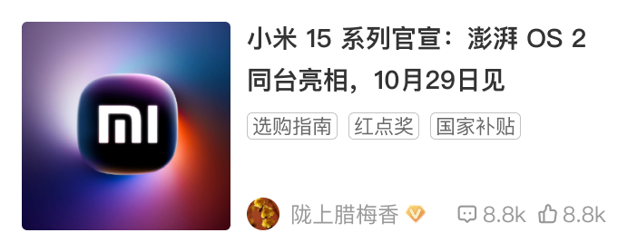

# 39003 · 首页单列原创

## 基本信息

| 项目 | 内容 |
| --- | --- |
| 卡片编号 | 39003 |
| 设计编号 | 39003 |
| 研发编号 | 39003 |
| 正式名称 | 首页单列原创 |
| 基于卡片 | 无明确继承关系 |
| 分类 | 首页单列 |
| 平台规则 | 默认跨端共用，例外待确认 |
| 生命周期 | 使用中（默认假设） |
| 档案状态 | 未人工确认 |
| Figma 来源 | [打开卡片节点](https://www.figma.com/design/bAgan5FT4BJsOkwGpIeGVM/?node-id=114-7270) |
| 最后修改版本 | 2026.09.01-r2 |

## Figma 备注（不属于卡片画面）

以下内容来自卡片旁的设计说明，只用于理解用途、状态和变更；不会合入卡片预览。

| 备注类型 | 原始备注 |
| --- | --- |
| relationship-or-mapping | 对应双列卡片：22001  常规标签 |
| unclassified | 商品大标签 |
| usage-detail | 你关注的达人 |
| state-or-condition | 已读 |
| change-detail | v11.1.35新增AIGC 注意：头像组合时，头像是15，比常规头像小 |
| unclassified | 头像少时 |
| state-or-condition | 只有1个来源时，头像是18，和常规头像一样 |
| state-or-condition | 兜底 头像是18，和常规头像一样 |
| change-detail | v11.1.53 AIGC调整，mugc去掉头像 |
| unclassified | v11.1.60标题前加特殊标签 |
| unclassified | 4字宽度示意 |
| unclassified | 3字宽度示意 |
| unclassified | 2字宽度示意 |
| unclassified | 标题显示 |
| unclassified | 三个字 |
| unclassified | 双字 |
| state-or-condition | 加载占位图 常规&暗色 3&4字的原来20040有 |
| change-detail | 个人主页-专栏落地页 直接调用，未做调整 |

## 卡片本体与示例

预览源节点：114:7270。卡片本体只取 Frame、Component、Component Set 或 Instance；外部编号标题与备注不进入预览。

| 示例 | 节点名称 | 节点类型 | 尺寸 | Node ID |
| --- | --- | --- | --- | --- |
| 1 | card/39003-ios | COMPONENT | 351 × 139 | 114:7270 |
| 2 | card/39003-ios | INSTANCE | 351 × 139 | 114:7479 |
| 3 | card/39003-ios | INSTANCE | 351 × 139 | 114:7973 |
| 4 | card/39003-ios | INSTANCE | 351 × 139 | 114:8055 |
| 5 | card/39003-ios | INSTANCE | 351 × 139 | 4590:40900 |
| 6 | card/39003-ios | INSTANCE | 351 × 139 | 4590:41002 |
| 7 | card/39003-ios | INSTANCE | 351 × 139 | 4590:41082 |
| 8 | card/39003-ios | INSTANCE | 351 × 139 | 4590:41227 |
| 9 | card/39003-ios | COMPONENT | 351 × 139 | 6363:48472 |
| 10 | card/39003-ios | INSTANCE | 351 × 139 | 7447:39302 |
| 1 | card/39003-Android | COMPONENT | 351 × 130 | 197:21021 |
| 2 | card/39003-Android | INSTANCE | 351 × 130 | 197:21053 |
| 3 | card/39003-Android | INSTANCE | 351 × 130 | 197:21491 |
| 4 | card/39003-Android | INSTANCE | 351 × 130 | 197:21605 |
| 5 | card/39003-Android | INSTANCE | 351 × 130 | 4590:41664 |
| 6 | card/39003-Android | INSTANCE | 351 × 130 | 4590:41749 |
| 7 | card/39003-Android | INSTANCE | 351 × 130 | 4590:41829 |
| 8 | card/39003-Android | INSTANCE | 351 × 130 | 4590:41914 |
| 9 | card/39003-Android | INSTANCE | 351 × 130 | 6363:48546 |
| 10 | card/39003-Android | INSTANCE | 351 × 130 | 7447:39506 |
| 1 | card/39003-ios | INSTANCE | 351 × 139 | 3318:37689 |
| 1 | card/39003-Android | INSTANCE | 351 × 130 | 3318:45086 |

## 权威编号来源

| Figma 页面 | 区域 | 平台 | 来源 |
| --- | --- | --- | --- |
| 首页 | 首页单列-01-ios | ios | [编号标题](https://www.figma.com/design/bAgan5FT4BJsOkwGpIeGVM/?node-id=100-16092) |
| 首页 | 首页单列-01-android | android | [编号标题](https://www.figma.com/design/bAgan5FT4BJsOkwGpIeGVM/?node-id=197-15801) |
| 我的 | 个人主页-iOS | ios | [编号标题](https://www.figma.com/design/bAgan5FT4BJsOkwGpIeGVM/?node-id=3318-37674) |
| 我的 | 个人主页-Android | android | [编号标题](https://www.figma.com/design/bAgan5FT4BJsOkwGpIeGVM/?node-id=3318-44088) |

## 使用说明

- 使用目的：待补充
- 适用场景：待补充
- 不适用场景：待补充
- 负责人：待补充

## 状态与变体

当前提取状态：not-scanned

| 状态名称 | Figma 原始名称 | 节点 | 尺寸 |
| --- | --- | --- | --- |
| 暂未完成状态提取 | — | — | — |

## 页面使用关系

| 页面 | 证据等级 | 证据节点 | 来源 |
| --- | --- | --- | --- |
| 1.2-收藏-文章 | Figma 可追溯 | card/39003-ios | [打开 Figma](https://www.figma.com/design/lrTnmEfWndqzFHY2kAqgHN/v11.1.95-%E6%96%B0%E7%89%88%E6%9C%AC%E6%B1%87%E6%80%BB?node-id=22023-23072) |
| 1.3-收藏-笔记 | Figma 可追溯 | card/39003-ios | [打开 Figma](https://www.figma.com/design/lrTnmEfWndqzFHY2kAqgHN/v11.1.95-%E6%96%B0%E7%89%88%E6%9C%AC%E6%B1%87%E6%80%BB?node-id=22023-23089) |
| 1.1-收藏-全部 | Figma 可追溯 | card/39003-ios | [打开 Figma](https://www.figma.com/design/lrTnmEfWndqzFHY2kAqgHN/v11.1.95-%E6%96%B0%E7%89%88%E6%9C%AC%E6%B1%87%E6%80%BB?node-id=22023-23106) |
| 3.3-我的发布-草稿箱-文章 | 推测匹配 | Avatar/39003-ios | [打开 Figma](https://www.figma.com/design/lrTnmEfWndqzFHY2kAqgHN/v11.1.95-%E6%96%B0%E7%89%88%E6%9C%AC%E6%B1%87%E6%80%BB?node-id=22136-3082) |
| 1.3-我的发布-文章-已发布 | 推测匹配 | Avatar/39003-ios | [打开 Figma](https://www.figma.com/design/lrTnmEfWndqzFHY2kAqgHN/v11.1.95-%E6%96%B0%E7%89%88%E6%9C%AC%E6%B1%87%E6%80%BB?node-id=22136-3438) |
| 1.3-我的发布-文章-已发布 | 推测匹配 | Avatar/39003-ios | [打开 Figma](https://www.figma.com/design/lrTnmEfWndqzFHY2kAqgHN/v11.1.95-%E6%96%B0%E7%89%88%E6%9C%AC%E6%B1%87%E6%80%BB?node-id=22552-104486) |
| 1.2-收藏-文章 | Figma 可追溯 | card/39003-ios | [打开 Figma](https://www.figma.com/design/lrTnmEfWndqzFHY2kAqgHN/v11.1.95-%E6%96%B0%E7%89%88%E6%9C%AC%E6%B1%87%E6%80%BB?node-id=22552-108937) |
| 1.3-收藏-笔记 | Figma 可追溯 | card/39003-ios | [打开 Figma](https://www.figma.com/design/lrTnmEfWndqzFHY2kAqgHN/v11.1.95-%E6%96%B0%E7%89%88%E6%9C%AC%E6%B1%87%E6%80%BB?node-id=22552-108954) |
| 1.1-收藏-全部 | Figma 可追溯 | card/39003-ios | [打开 Figma](https://www.figma.com/design/lrTnmEfWndqzFHY2kAqgHN/v11.1.95-%E6%96%B0%E7%89%88%E6%9C%AC%E6%B1%87%E6%80%BB?node-id=22552-108971) |
| 国补频道 | Figma 可追溯 | card/39003-Android | [打开 Figma](https://www.figma.com/design/lrTnmEfWndqzFHY2kAqgHN/v11.1.95-%E6%96%B0%E7%89%88%E6%9C%AC%E6%B1%87%E6%80%BB?node-id=22733-32579) |
| 国补频道-展开地区 | Figma 可追溯 | card/39003-Android | [打开 Figma](https://www.figma.com/design/lrTnmEfWndqzFHY2kAqgHN/v11.1.95-%E6%96%B0%E7%89%88%E6%9C%AC%E6%B1%87%E6%80%BB?node-id=22743-37402) |
| 国补频道暗色 | Figma 可追溯 | card/39003-ios | [打开 Figma](https://www.figma.com/design/lrTnmEfWndqzFHY2kAqgHN/v11.1.95-%E6%96%B0%E7%89%88%E6%9C%AC%E6%B1%87%E6%80%BB?node-id=22743-47562) |
| 我的收藏-文章 | Figma 可追溯 | card/39003-ios | [打开 Figma](https://www.figma.com/design/lrTnmEfWndqzFHY2kAqgHN/v11.1.95-%E6%96%B0%E7%89%88%E6%9C%AC%E6%B1%87%E6%80%BB?node-id=23196-143653) |
| 我的收藏-笔记 | Figma 可追溯 | card/39003-ios | [打开 Figma](https://www.figma.com/design/lrTnmEfWndqzFHY2kAqgHN/v11.1.95-%E6%96%B0%E7%89%88%E6%9C%AC%E6%B1%87%E6%80%BB?node-id=23196-143671) |
| 我的收藏-全部 | Figma 可追溯 | card/39003-ios | [打开 Figma](https://www.figma.com/design/lrTnmEfWndqzFHY2kAqgHN/v11.1.95-%E6%96%B0%E7%89%88%E6%9C%AC%E6%B1%87%E6%80%BB?node-id=23196-143689) |

## 相似卡片与差异

- 相似卡片：待补充
- 主要差异：待补充

## 待确认问题

- 同一编号存在多个标题说明：首页单列原创；专栏落地页文章卡片 同 首页单列原创。请确认正式名称及历史关系。

## AI 使用限制

- 未人工确认的用途、状态含义和相似差异不得自行补猜。
- 编号以页面中的卡片字号标题为准，不能因为组件或 Frame 仍沿用旧名称而改号。
- 设计备注属于知识说明，不属于卡片本体，不得渲染进卡片预览。
- Figma 可追溯只代表有强证据，不等于已经由设计确认。
- 长期无人确认时继续保留本档案，不自动删除或废弃。
