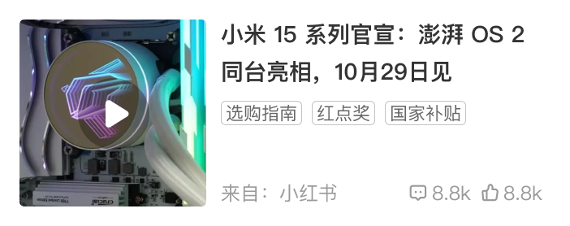

# 39005 · 首页单列转载

## 基本信息

| 项目 | 内容 |
| --- | --- |
| 卡片编号 | 39005 |
| 设计编号 | 39005 |
| 研发编号 | 39005 |
| 正式名称 | 首页单列转载 |
| 基于卡片 | 无明确继承关系 |
| 分类 | 首页单列 |
| 平台规则 | 默认跨端共用，例外待确认 |
| 生命周期 | 使用中（默认假设） |
| 档案状态 | 未人工确认 |
| Figma 来源 | [打开卡片节点](https://www.figma.com/design/bAgan5FT4BJsOkwGpIeGVM/?node-id=114-14453) |
| 最后修改版本 | 2026.09.01-r2 |

## Figma 备注（不属于卡片画面）

以下内容来自卡片旁的设计说明，只用于理解用途、状态和变更；不会合入卡片预览。

| 备注类型 | 原始备注 |
| --- | --- |
| relationship-or-mapping | 对应双列卡片：20034  视频 |
| state-or-condition | 已读 |
| unclassified | 新转载标识 |

## 卡片本体与示例

预览源节点：114:14453。卡片本体只取 Frame、Component、Component Set 或 Instance；外部编号标题与备注不进入预览。

| 示例 | 节点名称 | 节点类型 | 尺寸 | Node ID |
| --- | --- | --- | --- | --- |
| 1 | card/39005-ios | COMPONENT | 351 × 139 | 114:14453 |
| 2 | card/39005-ios | INSTANCE | 351 × 139 | 114:14459 |
| 3 | card/39005-ios | COMPONENT | 351 × 139 | 6468:58076 |
| 1 | card/39005-Android | COMPONENT | 351 × 130 | 197:22855 |
| 2 | card/39005-Android | INSTANCE | 351 × 130 | 197:22871 |

## 权威编号来源

| Figma 页面 | 区域 | 平台 | 来源 |
| --- | --- | --- | --- |
| 首页 | 首页单列-01-ios | ios | [编号标题](https://www.figma.com/design/bAgan5FT4BJsOkwGpIeGVM/?node-id=114-13716) |
| 首页 | 首页单列-01-android | android | [编号标题](https://www.figma.com/design/bAgan5FT4BJsOkwGpIeGVM/?node-id=197-15829) |

## 使用说明

- 使用目的：待补充
- 适用场景：待补充
- 不适用场景：待补充
- 负责人：待补充

## 状态与变体

当前提取状态：not-scanned

| 状态名称 | Figma 原始名称 | 节点 | 尺寸 |
| --- | --- | --- | --- |
| 暂未完成状态提取 | — | — | — |

## 页面使用关系

| 页面 | 证据等级 | 证据节点 | 来源 |
| --- | --- | --- | --- |
| 1.1-收藏-全部 | Figma 可追溯 | card/39005-ios | [打开 Figma](https://www.figma.com/design/lrTnmEfWndqzFHY2kAqgHN/v11.1.95-%E6%96%B0%E7%89%88%E6%9C%AC%E6%B1%87%E6%80%BB?node-id=22023-23106) |
| 1.1-收藏-全部 | Figma 可追溯 | card/39005-ios | [打开 Figma](https://www.figma.com/design/lrTnmEfWndqzFHY2kAqgHN/v11.1.95-%E6%96%B0%E7%89%88%E6%9C%AC%E6%B1%87%E6%80%BB?node-id=22552-108971) |
| 国补频道暗色 | Figma 可追溯 | 39005-ios | [打开 Figma](https://www.figma.com/design/lrTnmEfWndqzFHY2kAqgHN/v11.1.95-%E6%96%B0%E7%89%88%E6%9C%AC%E6%B1%87%E6%80%BB?node-id=22743-47562) |
| 我的收藏-全部 | Figma 可追溯 | card/39005-ios | [打开 Figma](https://www.figma.com/design/lrTnmEfWndqzFHY2kAqgHN/v11.1.95-%E6%96%B0%E7%89%88%E6%9C%AC%E6%B1%87%E6%80%BB?node-id=23196-143689) |

## 相似卡片与差异

- 相似卡片：待补充
- 主要差异：待补充

## 待确认问题

- 暂无已记录问题。

## AI 使用限制

- 未人工确认的用途、状态含义和相似差异不得自行补猜。
- 编号以页面中的卡片字号标题为准，不能因为组件或 Frame 仍沿用旧名称而改号。
- 设计备注属于知识说明，不属于卡片本体，不得渲染进卡片预览。
- Figma 可追溯只代表有强证据，不等于已经由设计确认。
- 长期无人确认时继续保留本档案，不自动删除或废弃。
