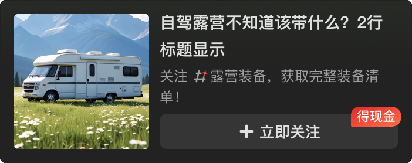

# 39036 · 单列新调研卡片-大图-ios

## 基本信息

| 项目 | 内容 |
| --- | --- |
| 卡片编号 | 39036 |
| 设计编号 | 39036 |
| 研发编号 | 39036 |
| 正式名称 | 单列新调研卡片-大图-ios |
| 基于卡片 | 无明确继承关系 |
| 分类 | 首页单列 |
| 平台规则 | 默认跨端共用，例外待确认 |
| 生命周期 | 使用中（默认假设） |
| 档案状态 | 未人工确认 |
| Figma 来源 | [打开卡片节点](https://www.figma.com/design/bAgan5FT4BJsOkwGpIeGVM/?node-id=6363-50969) |
| 最后修改版本 | 2026.09.01-r2 |

## Figma 备注（不属于卡片画面）

以下内容来自卡片旁的设计说明，只用于理解用途、状态和变更；不会合入卡片预览。

| 备注类型 | 原始备注 |
| --- | --- |
| unclassified | 卡片叠加了一层取色色值的渐变背景，卡片有白色描边 |
| state-or-condition | 位置：首页 v11.1.55 得现金标签可以配为不显示       加载loading，前面是动效        异常        加载完成        关注，点击后出toast         关注完成，按钮变化        点击查看更多的加载         点击查看更多的加载完成 |
| state-or-condition | 暗色 |

## 卡片本体与示例

预览源节点：6363:50969。卡片本体只取 Frame、Component、Component Set 或 Instance；外部编号标题与备注不进入预览。

| 示例 | 节点名称 | 节点类型 | 尺寸 | Node ID |
| --- | --- | --- | --- | --- |
| 1 | card39036 | FRAME | 100 × 139 | 6363:50865 |
| 1 | Frame 2036092682 | FRAME | 215 × 139 | 6363:50867 |
| 2 | card39036 | COMPONENT_SET | 391 × 1292 | 6363:50876 |
| 3 | card39036 | INSTANCE | 351 × 139 | 6363:50969 |
| 4 | card39036 | INSTANCE | 351 × 139 | 6363:50972 |
| 5 | card39036 | INSTANCE | 351 × 139 | 6363:50975 |
| 1 | card39036 | FRAME | 100 × 139 | 6363:51199 |
| 1 | Frame 2036092682 | FRAME | 215 × 139 | 6363:51201 |
| 2 | card39036 | COMPONENT_SET | 391 × 1220 | 6363:51210 |
| 3 | card39036 | INSTANCE | 351 × 130 | 6363:51315 |
| 4 | card39036 | INSTANCE | 351 × 130 | 6363:51318 |
| 5 | card39036 | INSTANCE | 351 × 130 | 6363:51321 |

## 权威编号来源

| Figma 页面 | 区域 | 平台 | 来源 |
| --- | --- | --- | --- |
| 首页 | 首页单列-02-ios | ios | [编号标题](https://www.figma.com/design/bAgan5FT4BJsOkwGpIeGVM/?node-id=5683-22600) |
| 首页 | 首页单列-02-ios | ios | [编号标题](https://www.figma.com/design/bAgan5FT4BJsOkwGpIeGVM/?node-id=6363-50862) |
| 首页 | 首页单列-02-android | android | [编号标题](https://www.figma.com/design/bAgan5FT4BJsOkwGpIeGVM/?node-id=5683-22812) |
| 首页 | 首页单列-02-android | android | [编号标题](https://www.figma.com/design/bAgan5FT4BJsOkwGpIeGVM/?node-id=6363-51196) |

## 使用说明

- 使用目的：待补充
- 适用场景：待补充
- 不适用场景：待补充
- 负责人：待补充

## 状态与变体

当前提取状态：not-scanned

| 状态名称 | Figma 原始名称 | 节点 | 尺寸 |
| --- | --- | --- | --- |
| 暂未完成状态提取 | — | — | — |

## 页面使用关系

| 页面 | 证据等级 | 证据节点 | 来源 |
| --- | --- | --- | --- |
| 5.3-首页-换肤-常规 | 推测匹配 | animation_redenvolope_jd_90x60_card39036_shouye | [打开 Figma](https://www.figma.com/design/lrTnmEfWndqzFHY2kAqgHN/v11.1.95-%E6%96%B0%E7%89%88%E6%9C%AC%E6%B1%87%E6%80%BB?node-id=22135-2454) |
| 5.2-首页-商业化-换肤浅色 | 推测匹配 | animation_redenvolope_jd_90x60_card39036_shouye | [打开 Figma](https://www.figma.com/design/lrTnmEfWndqzFHY2kAqgHN/v11.1.95-%E6%96%B0%E7%89%88%E6%9C%AC%E6%B1%87%E6%80%BB?node-id=22205-17388) |
| 5.1-首页-商业化-大Banner深色 | 推测匹配 | animation_redenvolope_jd_90x60_card39036_shouye | [打开 Figma](https://www.figma.com/design/lrTnmEfWndqzFHY2kAqgHN/v11.1.95-%E6%96%B0%E7%89%88%E6%9C%AC%E6%B1%87%E6%80%BB?node-id=22205-18086) |
| 5.4-首页-商业化-换肤状态下巨幕广告 | 推测匹配 | animation_redenvolope_jd_90x60_card39036_shouye | [打开 Figma](https://www.figma.com/design/lrTnmEfWndqzFHY2kAqgHN/v11.1.95-%E6%96%B0%E7%89%88%E6%9C%AC%E6%B1%87%E6%80%BB?node-id=22205-19594) |
| loading背景色区域 | 推测匹配 | animation_redenvolope_jd_90x60_card39036_shouye | [打开 Figma](https://www.figma.com/design/lrTnmEfWndqzFHY2kAqgHN/v11.1.95-%E6%96%B0%E7%89%88%E6%9C%AC%E6%B1%87%E6%80%BB?node-id=23185-242922) |
| loading背景色区域 | 推测匹配 | animation_redenvolope_jd_90x60_card39036_shouye | [打开 Figma](https://www.figma.com/design/lrTnmEfWndqzFHY2kAqgHN/v11.1.95-%E6%96%B0%E7%89%88%E6%9C%AC%E6%B1%87%E6%80%BB?node-id=23185-243644) |

## 相似卡片与差异

- 相似卡片：待补充
- 主要差异：待补充

## 待确认问题

- 同一编号存在多个标题说明：单列新调研卡片-大图-ios；单列新调研卡片-大图-android；单列新调研卡片-大图。请确认正式名称及历史关系。

## AI 使用限制

- 未人工确认的用途、状态含义和相似差异不得自行补猜。
- 编号以页面中的卡片字号标题为准，不能因为组件或 Frame 仍沿用旧名称而改号。
- 设计备注属于知识说明，不属于卡片本体，不得渲染进卡片预览。
- Figma 可追溯只代表有强证据，不等于已经由设计确认。
- 长期无人确认时继续保留本档案，不自动删除或废弃。
