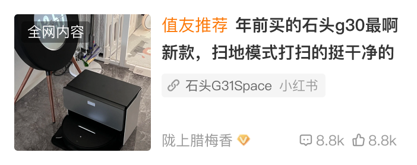

# 43016 · 搜索输入页顶部通栏广告位 23016

## 基本信息

| 项目 | 内容 |
| --- | --- |
| 卡片编号 | 43016 |
| 设计编号 | 43016 |
| 研发编号 | 43016 |
| 正式名称 | 搜索输入页顶部通栏广告位 23016 |
| 基于卡片 | 无明确继承关系 |
| 分类 | 搜索 |
| 平台规则 | 默认跨端共用，例外待确认 |
| 生命周期 | 使用中（默认假设） |
| 档案状态 | 未人工确认 |
| Figma 来源 | [打开卡片节点](https://www.figma.com/design/bAgan5FT4BJsOkwGpIeGVM/?node-id=1106-24595) |
| 最后修改版本 | 2026.09.01-r2 |

## Figma 备注（不属于卡片画面）

以下内容来自卡片旁的设计说明，只用于理解用途、状态和变更；不会合入卡片预览。

| 备注类型 | 原始备注 |
| --- | --- |
| unclassified | 图片上传尺寸为1010*196px |
| usage-detail | 48012 搜索单列转载 |
| usage-detail | 搜索复用首页卡片39031样式（ 搜索单列38012） |
| change-detail | 搜索的差异 1、综搜带类型标签，如好价、笔记等 2、卡片内间距调整 3、焦点图尺寸为115 4、互动数据那行样式见新标注 |
| unclassified | 有推荐理由  链接 |
| unclassified | 链接超长 |
| unclassified | 无推荐理由，链接部分变化 |
| unclassified | 视频 |

## 卡片本体与示例

预览源节点：1106:24595。卡片本体只取 Frame、Component、Component Set 或 Instance；外部编号标题与备注不进入预览。

| 示例 | 节点名称 | 节点类型 | 尺寸 | Node ID |
| --- | --- | --- | --- | --- |
| 1 | card/23016 | INSTANCE | 345 × 67 | 1106:24552 |
| 2 | 入库端 | FRAME | 58 × 16 | I1106:24585;5:32 |
| 3 | 11.0新蒙层标签 | INSTANCE | 58 × 18 | 1106:24588 |
| 4 | Frame 101 | FRAME | 65 × 37 | 1106:24590 |
| 5 | card/38012 | INSTANCE | 351 × 139 | 1106:24595 |
| 6 | card/38012 | INSTANCE | 351 × 139 | 1106:24598 |
| 7 | card/38012 | INSTANCE | 351 × 139 | 1106:24601 |
| 8 | card/38012 | INSTANCE | 351 × 139 | 1106:24604 |

## 权威编号来源

| Figma 页面 | 区域 | 平台 | 来源 |
| --- | --- | --- | --- |
| 搜索 | 搜索-01-android | android | [编号标题](https://www.figma.com/design/bAgan5FT4BJsOkwGpIeGVM/?node-id=1106-24549) |

## 使用说明

- 使用目的：待补充
- 适用场景：待补充
- 不适用场景：待补充
- 负责人：待补充

## 状态与变体

当前提取状态：not-scanned

| 状态名称 | Figma 原始名称 | 节点 | 尺寸 |
| --- | --- | --- | --- |
| 暂未完成状态提取 | — | — | — |

## 页面使用关系

| 页面 | 证据等级 | 证据节点 | 来源 |
| --- | --- | --- | --- |
| 暂无页面关系 | — | — | — |

## 相似卡片与差异

- 相似卡片：待补充
- 主要差异：待补充

## 待确认问题

- 卡片本体节点名称与权威编号不一致：card/23016、入库端、11.0新蒙层标签、Frame 101、card/38012。请确认是否为旧命名。

## AI 使用限制

- 未人工确认的用途、状态含义和相似差异不得自行补猜。
- 编号以页面中的卡片字号标题为准，不能因为组件或 Frame 仍沿用旧名称而改号。
- 设计备注属于知识说明，不属于卡片本体，不得渲染进卡片预览。
- Figma 可追溯只代表有强证据，不等于已经由设计确认。
- 长期无人确认时继续保留本档案，不自动删除或废弃。
